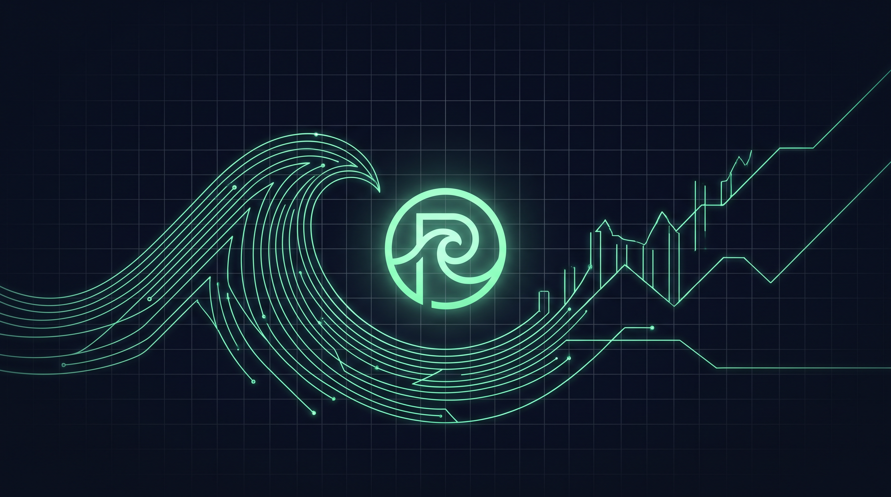

# Chapter 1: What is Pacifica?

> **Part:** Part 1: Foundations  
> **Estimated Reading Time:** 8 minutes  
> **Canonical Verification:** [docs.pacifica.fi](https://docs.pacifica.fi)  
> **Repository Index:** [The Pacifica Handbook](../README.md)

---

Mission, history, key statistics, and the team behind the largest decentralized perpetuals exchange on Solana.

## TL;DR

* Pacifica is a **decentralized perpetuals exchange on Solana** that has processed over **$220 billion** in cumulative perpetual volume since launching in June 2025.

* The product goes beyond perps: it includes **user-deployed Vaults**, the **Print** yield-bearing limit-order system, the **Swim** tap-prediction game, and an **AI Agent + World Monitor**.

* Backed by a hybrid hot/cold security architecture with **Squads Protocol** multi-signature governance over the cold vault.

* Self-funded — no external capital raised; all value created accrues to users.

## 1.1. Mission

Pacifica's stated mission is to *"deliver exceptional core trading performance through a seamless user experience, enhanced by AI-powered smart trading tools that make sophisticated strategies accessible to everyone."*[1]

In the team's own framing, Pacifica is *"not just building faster infrastructure — [they are] reimagining how trading should feel."*[1] The platform targets three specific industry challenges:

1. **Execution speed and quality** — CEX-grade latency on-chain.
2. **Seamless user experience** — onboarding, wallet, and margin in a single interface.
3. **Intelligent automation at scale** — AI agents and algorithmic strategies exposed to retail.

## 1.2. Key numbers

| Metric | Value | As of source date |
| --- | --- | --- |
| Founding | January 2025 | About page[1] |
| Mainnet launch | June 2025 (six months after founding) | About page[1] |
| Cumulative perpetual volume | Over$220 billion | About page[1] |
| Daily perpetual volume | Approximately$1 billion | About page[1] |
| Peak open interest | Over$100 million | About page[1] |
| Listed perpetual pairs | 65+(crypto majors, altcoins, RWAs, FX, pre-IPO) | About page[1] |
| Maximum leverage | Up to 50x(per market, varies) | Trading Overview[2] |
| Margining | Unified spot-and-collateral | Trading Overview[2] |
| Auditing firm | BlockSec | Audits page[3] |

> All numbers in this chapter are reproduced from the About Us page of the official documentation. The team's About page is updated as new milestones are reached — treat the figures above as the snapshot taken at time of writing.

## 1.3. Product surface

Pacifica's surface area has grown well beyond a single trading screen. As of the current release the application exposes the following entry points (visible in the navigation at `app.pacifica.fi`[4]):

| App entry | What it is |
| --- | --- |
| Trade | Perpetual and spot orderbooks on a CEX-style trading screen. |
| Print | Yield-bearing limit-order product (see Chapter 17). |
| Swim | Live tap-prediction game overlaid on price charts (Chapter 18). |
| Portfolio | Account equity, PnL history, margin mode per market. |
| Vaults | Discover, deposit into, or create user-deployed trading pools (Chapter 16). |
| Points | Weekly points dashboard and leaderboard (Chapter 19). |
| Leaderboard | Cross-program competition view. |
| Referral | Referral link generator and referee tracking (Chapter 20). |
| AI (Agent) | Pacifica's in-product AI agent for trading assistance and a World Monitor (news/macro feed). |

The interface is also available as a native **Android mobile app** (`com.pacifica.app` on Google Play). The mobile build offers the same trading surface as desktop.[5]

## 1.4. The team

Pacifica's founding team blends traditional finance, crypto-native, and AI backgrounds. The About page explicitly references prior experience at:

* **Crypto exchanges** — Binance, FTX, Coinbase, NFTperp

* **High-frequency trading firms** — including HFT teams

* **Traditional finance** — Jane Street, Fidelity

* **AI labs** — OpenAI, DeepMind

* **Tech / consumer** — ByteDance

* **Academia** — MIT, Stanford, NUS

The About page does not list individual founders by name; the team is presented as a collective of builders with deep domain expertise in three areas Pacifica needs to win at: **execution**, **UX**, and **AI**.

## 1.5. Funding and ownership

Pacifica is **self-funded**. The project has not raised external capital; "all value created accrues directly to users."[1]

In practice this means:

* No token pre-sale, no VC allocation, no pre-mine announced.

* Future token or governance distribution will be earned via activity (Points, programs) rather than purchased.

* Operating capital and team incentives are funded out of protocol revenue.

## 1.6. What Pacifica isnot

To set expectations correctly for a first-time reader:

* Pacifica is **not** a centralized exchange. Funds settle on-chain; the wallet remains in user control.

* Pacifica is **not** a spot-only venue — perpetuals are the primary product.

* Pacifica is **not yet** available in every jurisdiction. Access to trading functionality is **programmatically restricted** from IP addresses in the United States, Cuba, the Crimean Peninsula (including Sevastopol), Iran, Afghanistan, Syria, and North Korea (the "Restricted Jurisdictions").[2]

* Pacifica is **currently in closed beta**. Some limits apply — for example, a maximum of **$250,000 account equity** and a **$250,000-per-24-hour USDC withdrawal limit** during beta.[6]

## 1.7. Why "Pacifica"?

The platform is named after the Pacific Ocean — a deliberate nod to the geographic distribution of its team, its market-making council, and the multi-signature signers that secure the cold vault. The "Pacific" framing also matches the product's positioning: a single global liquidity pool, available 24/7, with no borders for users in supported jurisdictions.

## Pitfalls

* **Treating Pacifica as a CEX.** The trading UX is CEX-style, but custody, settlement, and even some risk parameters (dynamic margining, spot-collateral LTV, Pool-level deleveraging) are DeFi-native. A CEX trader's mental model can hide important on-chain risks.

* **Confusing the brand with the chain.** Pacifica is a Solana application, not the Solana base layer. Network-wide Solana outages or fee spikes will be visible in the app but are not Pacifica's responsibility.

* **Ignoring beta limits.** If you plan to move six-figure USDC in and out daily, the closed-beta caps will be a real constraint.

## Sources

1. [Pacifica — About Us (docs.pacifica.fi/pacifica/readme)](https://docs.pacifica.fi/pacifica/readme)
2. [Pacifica — Trading Overview (docs.pacifica.fi/trading-on-pacifica/overview)](https://docs.pacifica.fi/trading-on-pacifica/overview)
3. [Pacifica — Audits](https://docs.pacifica.fi/other/audits)
4. [Pacifica app — app.pacifica.fi](https://app.pacifica.fi/)
5. [@pacifica_fi on X — Mobile launch announcement](https://x.com/pacifica_fi)
6. [Pacifica — Deposits & Withdrawals](https://docs.pacifica.fi/trading-on-pacifica/deposits-and-withdrawals)

---

### Chapter Navigation
| Previous Chapter | Handbook Index | Next Chapter |
| :--- | :---: | ---: |
| *(First chapter)* | [**All 29 Chapters**](../README.md#table-of-contents) | [Chapter 2: Getting Started →](02-getting-started.md) |

*Official Documentation verified against [docs.pacifica.fi](https://docs.pacifica.fi). Trade perpetuals with zero VC dilution at [app.pacifica.fi](https://app.pacifica.fi?referral=SKYFOR).*
