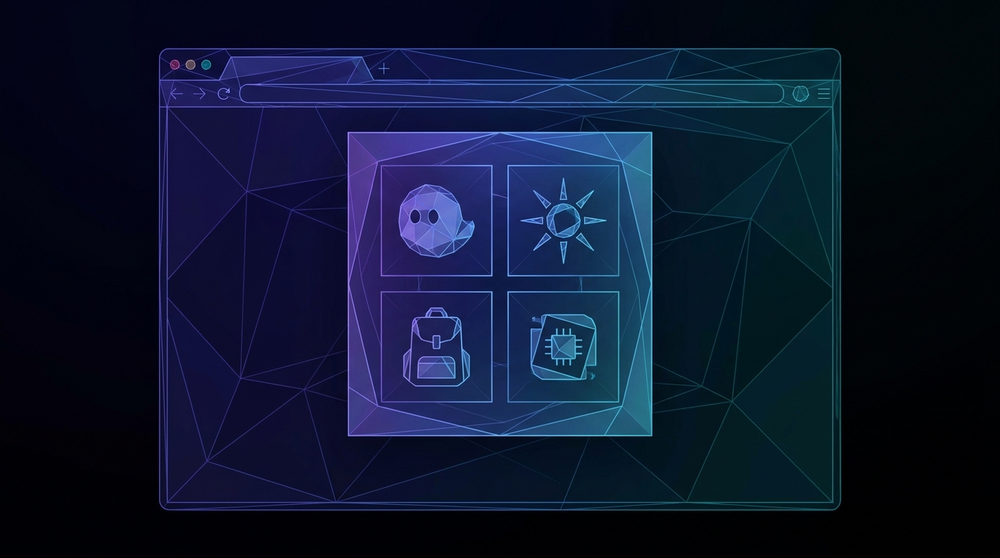

# Chapter 2: Getting Started

> **Part:** Part 1: Foundations  
> **Estimated Reading Time:** 7 minutes  
> **Canonical Verification:** [docs.pacifica.fi](https://docs.pacifica.fi)  
> **Repository Index:** [The Pacifica Handbook](../README.md)

---

Set up a Solana wallet, connect it to Pacifica, fund your account with USDC, and start trading in under 10 minutes.

## TL;DR

* Pacifica is **self-custodial**: you connect a Solana wallet; funds are bridged on-chain; the wallet, not the exchange, owns the keys.

* Supported wallets include **Phantom, Solflare, Backpack, Ledger (via browser extension)**, and any **WalletConnect-compatible** wallet.

* The minimum first deposit is **$10 USDC**. During the closed beta, account equity is **capped at $250,000**.

* A testnet (`https://test-app.pacifica.fi/trade/BTC`) lets you rehearse every flow with no real funds.

## 2.1. Prerequisites

Before connecting to Pacifica, set up a Solana wallet on a device you control. Pacifica documents the following as supported:[1]

| Wallet | Where to get it |
| --- | --- |
| Phantom | phantom.app— browser extension and mobile |
| Solflare | solflare.com— extension, mobile, web app |
| Backpack | backpack.app— extension and mobile |
| Ledger | Hardware wallet connected via Phantom or Solflare (browser extension flow) |
| Any WalletConnect-compatible wallet | Mobile wallets, custody providers, etc. |

> **Recommendation.** Use a hardware wallet (Ledger) for any balance you are not actively trading. A hot wallet (Phantom/Backpack extension) is fine for active capital. The account you connect to Pacifica holds the on-chain authority that can withdraw — losing the keys means losing access.

## 2.2. Connecting a wallet

1. Navigate to **[app.pacifica.fi](https://app.pacifica.fi/)**.
2. Click **Connect Wallet** in the top-right of the navigation.
3. Pick your wallet from the modal. Phantom, Solflare, and Backpack appear by default; click **WalletConnect** for the long tail.
4. Approve the connection request in your wallet extension. The wallet address (Solana public key) becomes your Pacifica account identifier.
5. Sign the one-time **session message**. Pacifica uses Ed25519 signatures for both session login and API authentication; the signature is local to your wallet and does not grant custody.[1]

> Note: as of the current documentation release, Pacifica has migrated authentication to **Privy** from the prior Reown/WalletConnect flow. If you have an old session, the **Recover Assets After Reown to Privy Migration** support article explains how to re-link your wallet.[2]

## 2.3. Funding the account

Once the wallet is connected, deposit **USDC** on **Solana** to start trading. The deposit is bridged from your wallet to Pacifica's on-chain program at the address `72R843XwZxqWhsJceARQQTTbYtWy6Zw9et2YV4FpRHTa`.[3]

### USDC deposit limits (closed beta)

| Parameter | Value |
| --- | --- |
| Minimum deposit | $10 |
| Maximum account equity | $250,000 |
| Network fee | Gas only(Solana network) |

The $250,000 cap is **enforced on the frontend**; deposits above the cap are gated in the UI, and API deposits that exceed it are held in **pending** until the limit is updated.[3]

### Deposit flow

1. Click **Deposit** in the app and pick **USDC**.
2. Enter the amount (≥ $10).
3. Approve the token transfer in your wallet.
4. Wait for the on-chain confirmation. After one Solana slot your USDC is credited to your Pacifica trading balance and is tradeable.

## 2.4. Withdrawing

USDC can be withdrawn back to the same wallet or to any Solana address you own.

| Parameter | Value |
| --- | --- |
| Minimum withdrawal | $1 |
| Per-account 24-hour cap | $250,000 |
| Network fee | $1 per withdrawal (gas) |

There is also an **exchange-wide withdrawal cap** as a risk-mitigation mechanism; under normal market conditions it does not affect retail withdrawals.[3]

A withdrawal is bounded by `available_to_withdraw`, which deducts any outstanding money-market borrow. If your USDC balance is negative (you implicitly borrowed), you cannot withdraw USDC until you either repay the borrow or sell enough spot to cover it.

## 2.5. Joining the closed beta

Pacifica is in **closed beta** at the time of writing. Two related documents govern access:

* **Close Beta Guide** — linked from the docs homepage, hosted as a Canva presentation; covers the application / whitelist process and current restrictions.[4]

* **Testnet Guide** — also a Canva link; gives you a sandbox at `https://test-app.pacifica.fi/trade/BTC` to try the app with no real funds.[5]

> **Why use the testnet first.** Several features — vault creation, builder-code approval, MCP server setup, advanced order types — have many moving parts. Burning $10 of real USDC to learn the flow is fine, but a wrong click on the live app while you're holding 50× leverage is not. Rehearse on testnet.

## 2.6. Your first trade (five minutes)

Once funded:

1. Pick a market from the left rail — **BTC** and **ETH** are the highest-liquidity pairs and the best place to start.
2. Choose **Cross** margin (default) and a leverage between **3x and 50x**, depending on the pair.
3. In the order ticket on the right, pick **Market** or **Limit**.
4. Enter size in base asset (e.g. BTC) or in USDC notional.
5. Click **Long** or **Short**.
6. Sign the order in your wallet (this is the Ed25519 signature described in Chapter 25).

Your position appears in the portfolio panel. Unrealized PnL updates in real time; maintenance margin is half the initial margin, and the engine will liquidate automatically if the mark price hits the liquidation level.

## Pitfalls

* **Signing a malicious session message.** Only sign the message presented inside `app.pacifica.fi`. Phishing sites can mimic the UI; verify the URL bar.

* **Depositing from an exchange that doesn't support Solana USDC.** Make sure your USDC is on the **Solana mainnet** (not Ethereum, Base, or other chains). Pacifica's bridge accepts only Solana USDC.

* **Confusing testnet and mainnet.** The testnet faucet issues play-USDC; trades have no real PnL. The URL paths differ: `app.pacifica.fi` vs `test-app.pacifica.fi`.

* **Re-using the referral link on a wallet that already has history.** The referral program only attaches on a **fresh** wallet, and the user must deposit before the referral is recorded.[6]

## Sources

1. [Pacifica — Deposits & Withdrawals](https://docs.pacifica.fi/trading-on-pacifica/deposits-and-withdrawals)
2. [Pacifica — Recover Assets After Reown to Privy Migration](https://docs.pacifica.fi/support/recover-assets-after-reown-to-privy-migration)
3. [Pacifica — Fund Security (on-chain program addresses)](https://docs.pacifica.fi/trading-on-pacifica/fund-security)
4. [Pacifica — Close Beta Guide](https://docs.pacifica.fi/pacifica/close-beta-guide)
5. [Pacifica — Testnet Guide](https://docs.pacifica.fi/pacifica/testnet-guide)
6. [Pacifica — Referral & Affiliate Program](https://docs.pacifica.fi/programs/referral-and-affiliate-program)

---

### Chapter Navigation
| Previous Chapter | Handbook Index | Next Chapter |
| :--- | :---: | ---: |
| [← Chapter 1: What is Pacifica?](01-what-is-pacifica.md) | [**All 29 Chapters**](../README.md#table-of-contents) | [Chapter 3: Fund Security Architecture →](03-fund-security.md) |

*Official Documentation verified against [docs.pacifica.fi](https://docs.pacifica.fi). Trade perpetuals with zero VC dilution at [app.pacifica.fi](https://app.pacifica.fi).*
