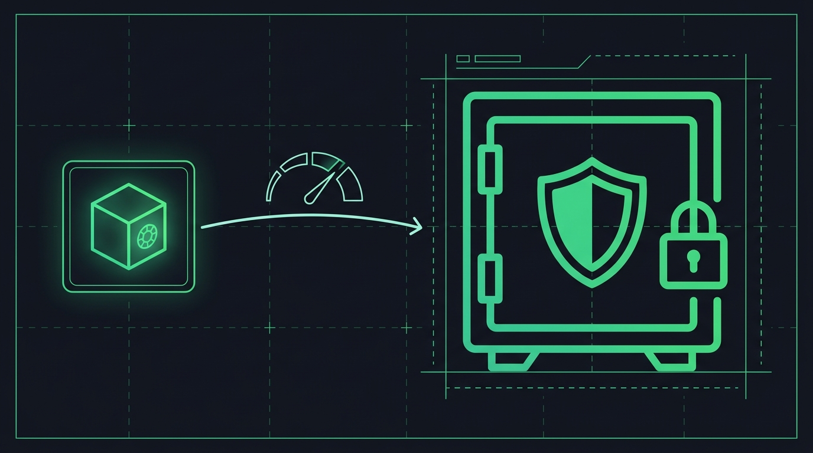

# Chapter 3: Fund Security Architecture

> **Part:** Part 1: Foundations  
> **Estimated Reading Time:** 9 minutes  
> **Canonical Verification:** [docs.pacifica.fi](https://docs.pacifica.fi)  
> **Repository Index:** [The Pacifica Handbook](../README.md)

---

How Pacifica's hot/cold hybrid model, Squads Protocol multi-sig, and on-chain program addresses keep user funds safe.

## TL;DR

* Pacifica runs a **hot/cold hybrid model**: a hot wallet (managed by the matching engine) executes withdrawals up to a programmed spending limit; a **Squads Protocol multi-sig** holds the bulk of capital in a cold vault.

* The **cold vault cannot send funds to arbitrary addresses** — its only job is to replenish the hot wallet up to a daily cap, after multi-party consensus.

* The architecture is **on-chain and verifiable**: every parameter, threshold, and authorization is recorded on Solana and can be independently audited.

## 3.1. The problem Pacifica is solving

In a traditional decentralized exchange, all user funds live in a **single upgradeable smart contract**. That contract holds the funds and delegates logic to an implementation behind a proxy. The trade-off is well known:

* **Speed.** The matching engine needs to move funds instantly on user withdrawal, so the withdrawal authority has to be hot and accessible.

* **Risk.** If the admin keys are compromised, the proxy can be upgraded to drain everything. If the smart contract has a bug, every user is exposed.

Most perp DEXs accept this concentration of risk in exchange for performance. Pacifica explicitly rejects the trade-off.

## 3.2. The Pacifica design: layered defense

The current design introduces **two distinct on-chain layers** with separated authority:

### The hot wallet (operational treasury)

* A small slice of total funds, sized for normal withdrawal flow.

* The matching engine can spend up to the **programmatic spending limit** without additional approvals.

* If the engine is breached, an attacker only ever reaches the funds in this hot wallet.

### The cold vault (fortress of funds)

* The bulk of user capital.

* Secured by a **Squads Protocol multi-sig** — the first formally verified program on Solana, securing more than $10 billion in assets across the ecosystem.

* Multi-sig means: multiple independent signers must approve every transaction. No single key can move funds.

* Squads adds time-locked upgrades, role-based access control, and an emergency pause that requires multi-party consensus.

* **The cold vault's logic is constrained by design.** It cannot send to arbitrary addresses; its only callable function is replenishing the hot wallet up to the spending cap.

## 3.3. The unbreakable chain of custody

The flow on a user withdrawal:

1. The user requests a withdrawal from the app.
2. The matching engine processes it **instantly from the hot wallet** — no signature ceremony required for amounts within the cap.
3. The hot wallet's balance dips below its threshold. A replenishment transaction is queued.
4. The **decentralized multi-sig council** reviews the request. Multiple independent signers must approve.
5. The cold vault sends **only the amount required to bring the hot wallet back to its cap** — never more.
6. Users can withdraw again. The cycle continues.

Even in the worst case where every operational system is breached — engine keys, AWS, insider credentials — the attacker is bounded by the hot-wallet cap. The majority of capital stays safe.

## 3.4. The attack matrix

The official documentation publishes this comparison:[1]

| Attack vector | Single-contract DEX | Pacifica hot/cold hybrid |
| --- | --- | --- |
| Engine compromise | All fundsexposed | Only hot wallet exposed |
| Smart-contract exploit | All fundsat risk | Only hot wallet at risk |
| Admin key compromise | Can upgrade to drainall funds | Requires multi-sig; spending limit enforced |
| Social engineering | Single point of failure | Multiple parties must be compromised |
| Inside threat | Unilateral access possible | Impossible without multi-party collusion |

The intuition is simple: in a single-contract model, one key is one catastrophe. In the hybrid model, the worst case from a single compromise is bounded by the hot-wallet cap.

## 3.5. On-chain addresses (verify yourself)

The architecture is **on-chain and verifiable** — anyone can read the program accounts and the cold-vault balances. The four key addresses published in the docs are:[1]

| Role | Address |
| --- | --- |
| USDC deposit/withdraw bridge | 72R843XwZxqWhsJceARQQTTbYtWy6Zw9et2YV4FpRHTa |
| SOL deposit/withdraw bridge | 9sSr35zwnFTuv2kZ86i55sR9dqQLTG663homexrLYgYu |
| USDC cold-vault | 5kwCMKjE3Krvs7cHfcQ9kBkGyPQphd3oJ4KnsXcpMoVc |
| SOL cold-vault | 8nFeyzTFhUXp11raJkSSvZWn9GXDjcrGq8LuzP9aKtg8 |

You can paste any of these into a Solana explorer (e.g. [Solscan](https://solscan.io/) or [Solana Explorer](https://explorer.solana.com/)) and inspect:

* The current SOL and SPL-token balances.

* The Squads multi-sig configuration (signer threshold, time-lock).

* Historical replenishments from cold → hot.

* Any pending upgrade proposals (if the time-lock is enabled).

The point is: **you do not have to trust Pacifica's claims. The cold vault and its constraints are visible on-chain.**

## 3.6. Time-locked governance

Squads supports **time-locked upgrade mechanisms** that mandate a delay between proposal and execution. For Pacifica, this means:

* A proposed change to withdrawal authorities or spending limits requires multi-sig approval *and* a time-lock window.

* During the time-lock, **users can see the proposed change and exit** if they disagree.

* The change cannot be applied retroactively or instantly.

This is governance as a firebreak, not governance as a backdoor.

## 3.7. Audits and bug bounty

Pacifica's documentation lists a **BlockSec audit report** as the formal security review, available as a PDF in the Audits section.[2]

The project also runs an active **bug bounty** with the following published reward tiers:[3]

| Severity | Bounty (USDC) |
| --- | --- |
| Critical | $10,000 – $25,000 |
| High | $2,500 – $10,000 |
| Medium | $500 – $2,500 |
| Low | $500 |

Reports go to `ops@pacifica.fi` or via a Discord ticket. Researchers must comply with KYC to receive payout, and must test on **testnet** — direct mainnet probing is prohibited and forfeits the reward.

## 3.8. What this architecture isnot

A few important things the model does not protect against:

* **User-side key loss.** If you lose the seed phrase of the wallet that controls your Pacifica account, you lose the account. There is no "forgot password" — that is the trade-off for self-custody.

* **Smart-contract bugs outside the cold vault.** The hot wallet and the matching engine are still software. The BlockSec audit reduces but does not eliminate the risk.

* **Sequencer / network outages.** Pacifica is on Solana. If Solana halts, no withdrawals process. This is true of every Solana app.

* **Oracle manipulation.** Liquidation and mark-price logic depend on the oracle composition described in Chapter 7. The oracle can be manipulated at the source (e.g. thin liquidity on a referenced CEX).

* **Closed-beta jurisdiction restrictions.** The closed-beta limits are policy, not protocol — they are reversible in either direction.

## Pitfalls

* **Treating self-custody as zero-trust.** Self-custody means *you* are responsible for the keys. Use a hardware wallet for any balance that would hurt to lose.

* **Assuming the cold vault is unlimited.** It is, by design, throttled. The hot-wallet cap is a circuit breaker, not a suggestion.

* **Bypassing the on-chain verifiability.** Anyone can verify the program addresses; you do not have to take the documentation's word for the architecture.

* **Hunting the audit report for silver bullets.** A clean audit is a snapshot. Use it together with bug-bounty, multi-sig, time-locks, and your own wallet hygiene.

## Sources

1. [Pacifica — Fund Security (docs.pacifica.fi/trading-on-pacifica/fund-security)](https://docs.pacifica.fi/trading-on-pacifica/fund-security)
2. [Pacifica — Audits](https://docs.pacifica.fi/other/audits)
3. [Pacifica — Bug Bounty Program](https://docs.pacifica.fi/programs/bug-bounty-program)

---

### Chapter Navigation
| Previous Chapter | Handbook Index | Next Chapter |
| :--- | :---: | ---: |
| [← Chapter 2: Getting Started](02-getting-started.md) | [**All 29 Chapters**](../README.md#table-of-contents) | [Chapter 4: Contract & Market Specifications →](04-contract-and-market-specs.md) |

*Official Documentation verified against [docs.pacifica.fi](https://docs.pacifica.fi). Trade perpetuals with zero VC dilution at [app.pacifica.fi](https://app.pacifica.fi).*
