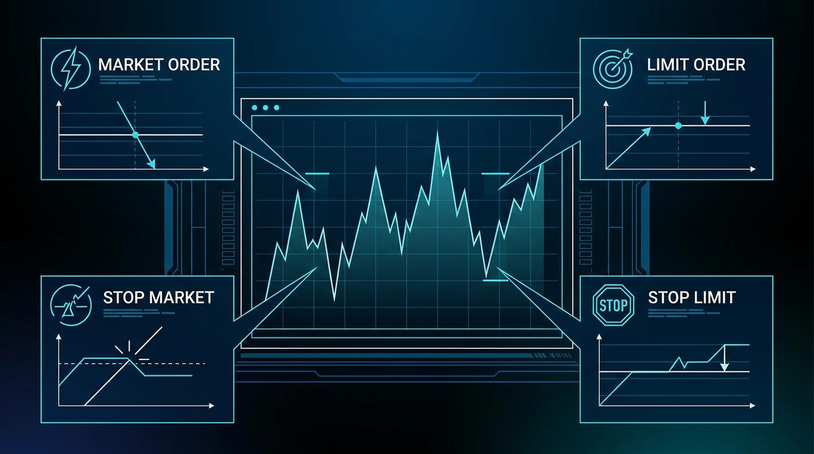

# Chapter 5: Order Types & Time-in-Force

> **Part:** Part 2: Trading Core  
> **Estimated Reading Time:** 7 minutes  
> **Canonical Verification:** [docs.pacifica.fi](https://docs.pacifica.fi)  
> **Repository Index:** [The Pacifica Handbook](../README.md)

---

Market, limit, stop market, stop limit — plus the four time-in-force flags every Pacifica order accepts.



## TL;DR

* Four order types: **Market, Limit, Stop Market, Stop Limit**.

* Four time-in-force flags: **GTC, IOC, ALO, TOB**.

* A **50–100 ms randomized delay** is applied to market orders and most limit orders to protect liquidity providers from adverse selection.

* Self-trade prevention auto-cancels the older of two opposing orders from the same account.

## 5.1. Order types

### Market

An order that executes immediately at the best available prices. Used to **enter or exit a position fast** without negotiating price.

```
You click "Long BTC, market, $10,000 notional, 10x".
You immediately receive BTC-perp at the best ask; you pay taker fee.
```

Market orders are subject to the leverage-tier size cap from Chapter 4. Slippage is governed by the book depth at the moment of execution.

### Limit

An order that specifies the price. Limit orders can rest on the book and are filled when the market reaches your price.

```
You click "Long BTC, limit 69,000, $10,000 notional, GTC".
The order rests on the bid side. If BTC trades through 69,000 you fill.
```

Limit orders are the **maker** path: when they rest, you typically earn the maker rebate (or pay the maker fee, which is lower than taker on every tier — see Chapter 9).

### Stop Market

A market order that is **triggered** when a price condition is met. Used to take profit or cut losses.

```
You hold a long. You set "Stop Market at 68,000".
If BTC trades to 68,000, the stop fires and a market sell is sent.
```

In practice the stop is evaluated against the **mark price**, not the last-trade price, to avoid manipulation by a single thin print.

### Stop Limit

A limit order that is **triggered** when a price condition is met. Used to enter or exit with a defined worst price.

```
You hold a long. You set "Stop Limit at 68,000, limit 67,950".
If BTC trades to 68,000, a limit sell at 67,950 is placed.
```

If the market gaps through 67,950 the order does *not* fill — that's the trade-off for the price guarantee.

## 5.2. Time-in-Force (TIF)

Every limit order on Pacifica belongs to one of four TIF families.

### Good-Til-Cancelled (GTC)

The order rests on the book until filled or cancelled. **Default for limit orders.** [1]

### Immediate-or-Cancel (IOC)

The order attempts to match at the specified price (or better). Anything that doesn't fill instantly is **cancelled**.

```
You send a 10 BTC limit at 69,000. The book has 4 BTC at 69,000.
4 BTC fill. The remaining 6 BTC are cancelled.
```

IOC is useful when you want to be a price-taker with a price cap.

### Add-Liquidity-Only (ALO)

Also known as **Post-Only**. The order is added to the book *only if* it does not immediately match against an existing order. If the price would cross, the order is cancelled at submission.[1]

```
You send a 10 BTC limit at 68,990 (bid side) but the best bid is 68,995.
ALO cancels — your order would have crossed.
```

ALO guarantees you the maker rebate. If you can't get filled, that's the cost.

### Top-of-Book (TOB)

A special ALO variant. If the order would otherwise be cancelled for crossing, TOB **places it at the best opposing price minus (or plus) one tick** instead.

```
You send a bid at 68,995, but the best ask is 68,990.
TOB places you at 68,989 (best ask − 1 tick) instead of cancelling.
```

TOB is the right TIF for makers who want the best possible fill without crossing the book.

## 5.3. The 50–100 ms delay

Pacifica's docs explicitly state:

> "In order to protect liquidity providers from adverse selection, all market orders, TIF GTC, and TIF IOC orders are subject to a randomized 50–100 ms delay."[1]

This is **not** a UI lag — it is a server-side delay applied at order entry. Practical implications:

* A market order placed in a fast market can fill a tick or two away from the price you saw in the UI. This is by design.

* ALO and TOB orders do not get the delay (they cannot be adversely selected against — they are resting, not taking).

* If you need instant execution in a fast market, the only tool you have is **larger size + taker fee**. The delay is a feature.

## 5.4. Self-trade prevention

When an incoming order would match against a **resting order from the same account**, Pacifica cancels the resting order and proceeds with the new one. The cancelled order is labelled **"Rejected"** in your order history.[2]

Practical implications:

* You cannot self-trade — useful when a bot has duplicate logic or when you accidentally rest a buy and a sell at the same price.

* The "rejected" status is normal and not a sign of platform error.

## 5.5. Reduce-only and order flags

Beyond TIF, several flags modify order behavior:

* **reduce_only** — order can only decrease the size of an existing position; the orderbook engine rejects the order if it would open or increase.

* **post_only / ALO** — covered above; guarantees maker.

* **take_profit / stop_loss** — orders attached to an open position; the engine watches the mark price and triggers the order when the level is hit.

## 5.6. Choosing the right combination

| Goal | Best type + TIF |
| --- | --- |
| Get filled now, no price preference | Market |
| Take profit on a long at a price above the market | Limit, GTC, side = Sell |
| Stop-loss on a long at a price below the market | Stop MarketorStop Limit |
| Provide maker liquidity with a price guarantee | Limit, ALO |
| Best-possible fill without crossing | Limit, TOB |
| Lift liquidity at a price cap | Limit, IOC |
| Avoid self-trade | (no action needed — automatic) |

## Worked example: a partial-fill IOC

You want to buy 10 ETH at $3,500 or better. The book shows:

| Side | Price | Size |
| --- | --- | --- |
| Ask | $3,500.5 | 4 ETH |
| Ask | $3,501.0 | 2 ETH |
| Ask | $3,501.5 | 10 ETH |

You send a **Limit Buy at $3,500, IOC, 10 ETH**.

* The 4 ETH at $3,500.5 fill. 6 ETH remain.

* IOC cancels the 6 ETH.

* Your average fill is $3,500.5; you paid the taker fee on 4 ETH.

## Pitfalls

* **Confusing Stop Market with Stop Limit.** Stop Market guarantees the trigger fires; Stop Limit guarantees the price but can miss the fill.

* **Using ALO and being surprised by cancellations.** ALO cancels if your order would cross; you won't get filled if you misprice.

* **Forgetting the 50–100 ms delay on Market orders.** Your "instant" fill can be a tick or two away from the visible book.

* **Assuming GTC means forever.** GTC orders rest until filled or **cancelled by you**. There is no expiry; cancel them yourself when you're done.

## Sources

1. [Pacifica — Order Types](https://docs.pacifica.fi/trading-on-pacifica/order-types)
2. [Pacifica — Self-Trade Prevention](https://docs.pacifica.fi/trading-on-pacifica/self-trade-prevention)

---

### Chapter Navigation
| Previous Chapter | Handbook Index | Next Chapter |
| :--- | :---: | ---: |
| [← Chapter 4: Contract & Market Specifications](04-contract-and-market-specs.md) | [**All 29 Chapters**](../README.md#table-of-contents) | [Chapter 6: Margin & Leverage →](06-margin-and-leverage.md) |

*Official Documentation verified against [docs.pacifica.fi](https://docs.pacifica.fi). Trade perpetuals with zero VC dilution at [app.pacifica.fi](https://app.pacifica.fi?referral=SKYFOR).*
