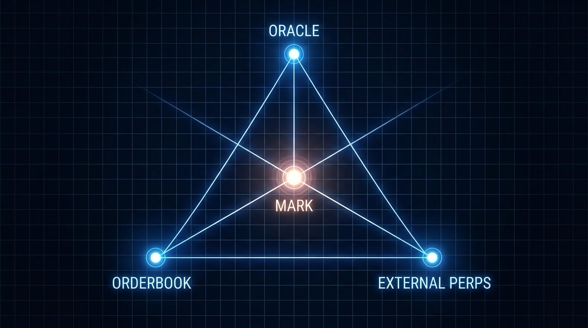

# Chapter 7: Oracle Price & Mark Price

> **Part:** Part 2: Trading Core  
> **Estimated Reading Time:** 7 minutes  
> **Canonical Verification:** [docs.pacifica.fi](https://docs.pacifica.fi)  
> **Repository Index:** [The Pacifica Handbook](../README.md)

---

How Pacifica builds a manipulation-resistant price from external venues, and how the mark price layers in orderbook data.

## TL;DR

* The **Oracle Price** is a weighted USDT price of major CEX spot quotes, refreshed every **3 seconds**.

* The **Mark Price** is the **median of three values**: oracle price, the median of Pacifica's own best bid / ask / last trade, and the external perpetual mark.

* Mark price is what determines **liquidations, margin requirements, and unrealized PnL**.

## 7.1. Why two prices?

A perpetual DEX cannot trust a single venue's price. If the venue is manipulated, thinned, or paused, the entire book can be steered against users. Pacifica uses two layers:

1. **Oracle Price** — the "external truth" the engine trusts for funding and as one of three inputs to the mark.
2. **Mark Price** — the actual price that determines your PnL and liquidation.

Mark is the more conservative of the two, by design.

## 7.2. Oracle Price — the composition

The oracle is **a weighted USDT-denominated price of major exchanges**, refreshed every **3 seconds**.[1]

| CEX | Weight |
| --- | --- |
| Binance | 2 |
| OKX | 1 |
| Bybit | 1 |
| Hyperliquid | 1 |

The weights are on the spot index. The mark price additionally references **perpetual mark prices from Binance, OKX, Bybit, and Hyperliquid** for crypto markets, and the RWA venues (trade.xyz, Lighter, Bitget) for equities, FX, and commodities.[2]

### What the oracle is used for

* **Funding rate calculation** — alignment with spot markets (Chapter 8).

* **Mark price as a component** — see below.

It is **not** used directly for liquidations or PnL.

## 7.3. Mark Price — the median of three

The mark price is the **median** of three components:[1]

1. **Oracle (spot) price** — as above.
2. **The median of**:
3. Pacifica's best bid,
4. Pacifica's best ask,
5. Pacifica's last trade.
6. **External perpetual mark** — a composite of perp marks from Binance, OKX, Bybit, Hyperliquid (or the RWA venues for non-crypto markets).

A median is used because it cannot be moved by a single outlier. If the Pacifica orderbook briefly shows a 50% deviation (thin book, fat-finger), the median is dominated by the other two components.

### What mark is used for

* **Liquidation calculations** — fair and accurate, not driven by a single venue.

* **Margin requirements** — both initial and maintenance.

* **Unrealized PnL** — mark-to-market on every tick.

## 7.4. The refresh cadence

* Oracle: every **3 seconds**.

* Mark: derived from the oracle, the orderbook, and external perps. Recomputed as the inputs move.

* Funding: sampled every **5 seconds** for the next-hour funding estimate, with a TWAP over each 1-hour interval.

In normal market conditions, oracle and mark trade within a few basis points of each other. They diverge when:

* A referenced CEX briefly halts or prints stale data.

* The Pacifica orderbook becomes one-sided (e.g., a large whale lifts the ask).

* Funding is rapidly pushing the basis in one direction.

## 7.5. How a trader uses this

You don't trade the oracle — you trade the Pacifica orderbook. But the **mark price is what determines your liquidation level**, so a useful mental model is:

* Your liquidation price is set by the **median of the three mark components**, not by the last print on the orderbook.

* A one-tick wick on Pacifica's book will not liquidate you if the oracle and external perp marks haven't moved.

* A real move across all three components will.

This is what makes Pacifica's mark price robust to short-term manipulation. You cannot push the liquidation of a position by temporarily manipulating Pacifica's own orderbook.

## 7.6. Pre-market special case

For **pre-markets** (newly listed pairs without external venues), Pacifica uses its own mark price as the oracle reference, smoothed by an **EMA** to prevent manipulation. A **±30% price band** is also applied around the mark price.[3]

Once other major venues list the same market, their prices get folded into the oracle to make it more robust.

## 7.7. Verification

Both oracle and mark prices are exposed through:

* The trading interface (top of the chart).

* API endpoints: `GET /api/v1/markets` for mark, `GET /api/v1/markets/get-prices` for oracle / mark / funding.

* WebSocket subscriptions: `prices` and `mark_price_candle`.

You can always check the inputs to your own liquidation price.

## Pitfalls

* **Assuming the last trade = liquidation price.** Your liquidation is driven by the mark, not the last print. They can differ.

* **Trading thin books at extreme hours.** A thin Pacifica orderbook can briefly show a wide deviation from oracle. The median mark protects you from being liquidated on that deviation, but it can still cause visible PnL swings.

* **Ignoring pre-market ±30% bands.** On a pre-market, the mark can pause trading if the price tries to escape the band. Don't expect a clean stop hunt.

* **Mixing up Oracle and Mark in API responses.** Most user-facing tools (portfolio, PnL) use mark. Funding uses oracle as one input. Read the field labels.

## Sources

1. [Pacifica — Oracle Price & Mark Price](https://docs.pacifica.fi/trading-on-pacifica/contract-specifications/oracle-price-and-mark-price)
2. [Pacifica — Market Specifications (oracle composition per market)](https://docs.pacifica.fi/trading-on-pacifica/contract-specifications/market-specifications)
3. [Pacifica — Pre-Markets](https://docs.pacifica.fi/trading-on-pacifica/contract-specifications/pre-markets)

---

### Chapter Navigation
| Previous Chapter | Handbook Index | Next Chapter |
| :--- | :---: | ---: |
| [← Chapter 6: Margin & Leverage](06-margin-and-leverage.md) | [**All 29 Chapters**](../README.md#table-of-contents) | [Chapter 8: Funding Rates →](08-funding-rates.md) |

*Official Documentation verified against [docs.pacifica.fi](https://docs.pacifica.fi). Trade perpetuals with zero VC dilution at [app.pacifica.fi](https://app.pacifica.fi).*
