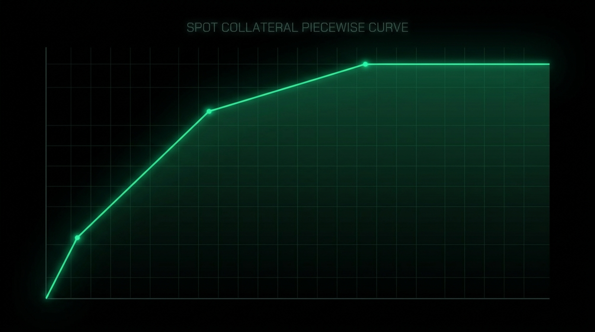

# Chapter 12: Unified Margin & Spot Collateral

> **Part:** Part 3: Advanced Mechanics  
> **Estimated Reading Time:** 7 minutes  
> **Canonical Verification:** [docs.pacifica.fi](https://docs.pacifica.fi)  
> **Repository Index:** [The Pacifica Handbook](../README.md)

---

How USDC balance, spot holdings, and perp PnL pool into a single account equity, and the spot-collateral formula.




## TL;DR

* Unified margin pools **USDC + unrealized PnL + LTV-adjusted spot** into one account equity.

* Each spot asset has four collateral parameters: `collateral_enabled`, `ltv_ratio`, `spread_divisor`, `collateral_value_limit_usd`.

* A spot balance that is **hedged by a cross-margin short** in the same underlying gets a higher LTV via `spread_divisor`.

## 12.1. The unified account equity

A cross-margin Pacifica account has a **single equity figure** that backs all cross positions:[1]

```
equity = usdc_balance
       + unrealized_pnl_cross
       + spot_collateral_value
       - pending_interest
```

Each component:

* **`usdc_balance`** — settled USDC in the account.

* **`unrealized_pnl_cross`** — mark-to-market PnL on every open cross perp position. Updated continuously. Isolated positions are excluded.

* **`spot_collateral_value`** — the LTV-adjusted value of every spot asset you hold (see Section 12.2).

* **`pending_interest`** — interest accrued but not yet settled on any money-market borrow. Deducted as it accrues.

A positive equity supports all cross positions. A negative equity is treated as a money-market borrow (see Chapter 13).

## 12.2. Spot collateral — the per-asset formula

Each spot asset is described by four parameters:[2]

| Parameter | Meaning |
| --- | --- |
| collateral_enabled | If false, the asset contributes zero collateral (currently all spot assets are enabled). |
| ltv_ratio | Loan-to-value, between 0 and 1. Typical: 0.90 (BTC, ETH), 0.80 (majors). |
| spread_divisor | Hedging bonus multiplier. Applied to the hedged portion of the balance. Optional. |
| collateral_value_limit_usd | Per-(user, asset) cap on gross market value eligible for collateral. Default$10,000. |

You can read these via the API: `GET /api/v1/spot_assets` returns the values for every supported spot asset.

### The collateral curve

For a balance `B` at oracle price `P`, with hedged size `H` (the portion offset by a cross-margin short of the same underlying):

```
capped_units = collateral_value_limit_usd / P
collateral =
    if B <= capped_units:
        B × P × ltv_ratio × (1 + hedging_bonus(H))
    else:
        capped_units × P × ltv_ratio × (1 + hedging_bonus(H))
```

**Units beyond `capped_units` contribute no additional collateral.** They remain in the account and are fully tradeable, but they don't add to your margin.

The maximum collateral a single (user, asset) pair can contribute is therefore `ltv_ratio × collateral_value_limit_usd`. At `ltv_ratio = 0.9` and the $10,000 default cap, the max is **$9,000**.[2]

## 12.3. The hedging bonus

When a spot balance is hedged by a cross-margin short in the same underlying, the hedged portion gets a higher LTV via `spread_divisor`. The intuition is that a delta-neutral hedged position is less risky than naked spot, so it deserves more collateral credit.

### Worked example

You hold **100 SOL** spot. SOL is at **$150**. SOL has `ltv_ratio = 0.80`, `spread_divisor = 1.05`. You also have a **50 SOL cross-margin short** on SOL-PERP. Assume the balance is below the per-user cap.

Without the hedge:

```
collateral = 100 × 150 × 0.80 = $12,000
```

With the hedge (the 50 SOL hedged portion gets the bonus):

```
hedged_collateral = 50 × 150 × 0.80 × 1.05 = $6,300
unhedged_collateral = 50 × 150 × 0.80 = $6,000
total = $12,300
```

The hedge adds roughly **$300 of additional collateral** (the docs example reports ~$71.4 of additional collateral for a similar setup; the difference is parameter-dependent).[2]

## 12.4. The implicit-borrow shortcut

In a unified-margin account, **opening a perp against spot collateral is borrow-free**:

* You don't post a separate margin for the perp.

* The spot balance is already part of equity.

* The perp is margined against the unified equity.

**The exception is isolated perp positions.** For isolated perps, the entire required margin is **borrowed upfront** from the money market, because the position cannot draw on equity. This is a small but important asymmetry: isolated margin costs more to set up.

## 12.5. When equity goes negative: implicit borrowing

If `equity_without_spot` (equity ignoring spot collateral) drops below zero, the account is treated as a borrower:

```
required_borrow = max(0, -equity_without_spot)
```

The shortfall is **covered implicitly** by the money market. This can happen because:

* USDC balance went negative (cross perp losses bigger than USDC).

* Accrued interest pushed equity below zero.

* Initial margin for a new perp couldn't be met from USDC alone.

**No user action is required**, and no explicit borrow transaction is submitted. Interest accrues on the outstanding amount.

**The borrow only proceeds if the account holds enough spot collateral to cover the shortfall under effective LTV.** If not, the account is **flagged for deleveraging** (Chapter 14).

## 12.6. Excluding assets from unified margin

You can set `unified_margin_excluded = true` on a (user, asset) pair. The asset's balance remains in the account and can be bought, sold, withdrawn, or transferred — but it contributes **zero** collateral for perpetual margining.[1]

This is useful when:

* You hold a long-term spot position that you don't want to risk being liquidated by a perp loss.

* You're running an isolated strategy on the same wallet and want clean separation.

* The asset's LTV is too low to make cross-margining worth it.

## 12.7. Subaccounts and unified margin

Subaccounts are **margined independently**. Spot collateral and USDC in a subaccount back only that subaccount's positions. Master → subaccount transfers are subject to standard margin checks.[1]

This is the right design for separating strategies while keeping them under one wallet.

## 12.8. Account-level deleveraging — when the math breaks

If the spot collateral value can no longer support the USDC debt and any perp IMM, the account enters **account-level spot deleveraging**: the system starts selling spot into the orderbook to repay USDC loans.[3]

This is a separate code path from perpetual liquidations. It runs:

1. **Account-level** — when an individual borrower's spot collateral is insufficient.
2. **Pool-level** — when money-market `utilization >= 95%`. The largest borrowers are deleveraged first, with a target of bringing utilization back to 90%.

In both modes, the system begins liquidating spot assets on the account's behalf into the spot orderbook to repay USDC loans.

## Pitfalls

* **Assuming all spot is full-collateral.** A 1 BTC spot balance contributes ≤ 90% of its value, capped at the per-user default of $10,000.

* **Forgetting the hedging bonus requires a *cross-margin* short.** An isolated short doesn't count. Use cross if you want the bonus.

* **Reading the default $10,000 cap as a hard limit.** Admin can raise it. Ask if you need more.

* **Using `unified_margin_excluded` and then expecting cross-margin to work.** The asset is excluded; nothing backs perps from that asset.

## Sources

1. [Pacifica — Unified Margin](https://docs.pacifica.fi/trading-on-pacifica/unified-margin)
2. [Pacifica — Spot Collateral](https://docs.pacifica.fi/trading-on-pacifica/spot-collateral)
3. [Pacifica — Liquidations (spot insolvency deleveraging)](https://docs.pacifica.fi/trading-on-pacifica/liquidations)

---

### Chapter Navigation
| Previous Chapter | Handbook Index | Next Chapter |
| :--- | :---: | ---: |
| [← Chapter 11: Pre-Markets](11-pre-markets.md) | [**All 29 Chapters**](../README.md#table-of-contents) | [Chapter 13: Money Market →](13-money-market.md) |

*Official Documentation verified against [docs.pacifica.fi](https://docs.pacifica.fi). Trade perpetuals with zero VC dilution at [app.pacifica.fi](https://app.pacifica.fi?referral=SKYFOR).*
