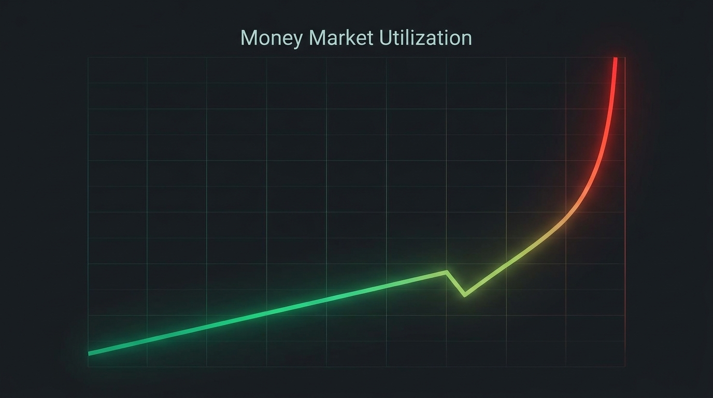

# Chapter 13: Money Market

> **Part:** Part 3: Advanced Mechanics  
> **Estimated Reading Time:** 6 minutes  
> **Canonical Verification:** [docs.pacifica.fi](https://docs.pacifica.fi)  
> **Repository Index:** [The Pacifica Handbook](../README.md)

---

Lend, borrow, and the implicit-borrow mechanic — plus the kink and exponential rate curves.



## TL;DR

* Pacifica operates a **single USDC money market** shared across all cross-margin accounts.

* Lending and borrowing are **implicit** — opening a perp against spot collateral does not require an explicit borrow.

* The pool uses a **piecewise APR curve**: linear up to a kink, exponential after.

* Current defaults: `MIN_BORROW_APR = 1%`, `LINEAR_KINK_APR = 10.95%`, `EXPONENTIAL_TARGET_APR = 50%`.

## 13.1. The single USDC pool

Pacifica runs **one USDC money market** for the entire platform. All cross-margin accounts share the same pool. Spot assets are never rehypothecated — they serve as collateral, not as lendable supply.[1]

The pool tracks aggregate state via `GET /api/v1/loan_pool`, which returns:

* Total supply (`total_borrowable`).

* Total borrowed.

* Utilization.

* Current borrow and lend rates.

## 13.2. Lenders and borrowers — implicit, not explicit

Lending and borrowing on Pacifica are **implicit**. There is no "deposit USDC to lend" action; it happens automatically as a side effect of cross-margin activity.

**Lenders** are accounts with idle USDC above a threshold:

* USDC balance ≥ **1,000 USDC** (the minimum lender threshold).

* Lendable capacity (USDC minus the 10% initial-margin floor, pending interest, and USDC locked by spot buys) ≥ 1,000 USDC.

* `auto_lend_disabled` is `false`.

**Borrowers** are accounts that need USDC they don't have:

* `equity_without_spot < 0`.

* The shortfall is `required_borrow = max(0, -equity_without_spot)`.

* The borrow proceeds only if the account has enough spot collateral under effective LTV.

The borrow is settled **implicitly** — no transaction is submitted, no "Borrow" button clicked. The platform's matching engine simply charges interest on the negative balance.

## 13.3. The rate curve

The borrow APR is a **piecewise function of utilization** `u = borrowed / total_borrowable`.[1]

```
if u <= u_kink:        borrow_apr = MIN_BORROW_APR + (LINEAR_KINK_APR − MIN_BORROW_APR) × (u / u_kink)
else:                  borrow_apr = LINEAR_KINK_APR + (EXPONENTIAL_TARGET_APR − LINEAR_KINK_APR) × ((u − u_kink) / (1 − u_kink))^2
```

Defaults:

| Parameter | Value |
| --- | --- |
| MIN_BORROW_APR | 1% |
| LINEAR_KINK_APR | 10.95% |
| EXPONENTIAL_TARGET_APR | 50% |
| Kink utilization | 80% (current default) |

At `u = 1` (full utilization), the curve reaches exactly `EXPONENTIAL_TARGET_APR` (50%). The exponential form keeps rates from spiking smoothly and discourages concentrated borrowing.

**Lender APR** is derived pro-rata from utilization:

```
lender_apr = borrow_apr × u × (1 - reserve_factor)
```

`reserve_factor` is a small fraction kept by the protocol.

Rates are **compounded per second**, so `APY ≈ e^APR − 1` — at 10% APR, the APY is roughly 10.52%.

## 13.4. Utilization thresholds

| Threshold | Utilization | Behavior |
| --- | --- | --- |
| Optimal | 80% | Borrow APR equals the kink rate. |
| Order admission | > 90% | Borrowing accountscannot place new non-reduce-only perp orders. Spot orders are unaffected. Non-borrowing accounts are unaffected. |
| Pool deleveraging | ≥ 95% | Pool-level spot deleveraging begins. |
| Pool deleveraging target | 90% | Deleveraging aims to bring utilization back to 90%. |

The 90% order-admission threshold is the circuit breaker: when the pool is stressed, borrowers cannot add more risk.

## 13.5. Interest accrual and payout

Every **60 seconds**, each borrower's `pending_interest` grows by:

```
pending_interest += borrow_balance × (borrow_apr / (365 × 24 × 60))
```

Every **hour**, accumulated `pending_interest` is **charged to the borrower's USDC balance** and **distributed pro-rata to lenders' USDC balances**.

The hourly cycle is the same one used for funding — both settle together.

## 13.6. The opt-outs

There are two opt-outs, both under your control:

* **Stop lending.** Set `auto_lend_disabled = true`. Your USDC remains usable for trading but is excluded from `total_borrowable` and earns no yield.

* **Exclude a spot asset from unified margin.** Set `unified_margin_excluded = true`. The asset remains in the account and tradeable but contributes no collateral and cannot back a borrow.

**Borrowing itself cannot be disabled.** If your `equity_without_spot` drops below zero and you have enough spot collateral, the borrow happens automatically.

## 13.7. Worked example: a cross-margin borrow

You have **$0 USDC** and **$15,000 of BTC spot** (LTV 90%, below the $10,000 cap, so collateral = $9,000). You open a **$20,000 long BTC-PERP** at 10x with no USDC.

```
equity_without_spot = 0 (no USDC)
spot_collateral_value = 9,000
equity = 9,000
IMM = 20,000 / 10 = 2,000
```

You don't borrow — equity covers IMM with $7,000 to spare. No interest accrues.

Now BTC drops 5%. Your perp is at $19,000 notional, equity is roughly:

```
unrealized_pnl = -1,000
usdc_balance = 0
equity = 9,000 - 1,000 = 8,000
```

Still positive. No borrow.

Now BTC drops 25%. Your perp notional is $15,000, equity is:

```
unrealized_pnl = -5,000
usdc_balance = 0
equity_without_spot = 0 - 5,000 = -5,000
required_borrow = 5,000
```

You implicitly borrow $5,000 from the pool. Interest starts accruing on $5,000 at the current borrow APR. If the pool is at 80% utilization, the APR is 10.95%, so hourly interest ≈ $5,000 × 10.95% / 8760 ≈ **$0.06/hour**. Over a day that's about **$1.50**. Cheap insurance against a forced deleveraging.

## Pitfalls

* **Hitting the 90% admission cap and being locked from new orders.** Borrowing accounts can't add risk in a stressed pool. Reduce exposure first.

* **Forgetting `pending_interest` in equity.** It's deducted the moment it accrues, so the account can quietly slip into borrowing without showing a negative USDC balance first.

* **Opting out of lending and then wondering why your USDC earns nothing.** The default is to lend; opt-out is an action you take.

* **Excluding an asset from unified margin and then expecting it to back a borrow.** It can't — exclusion is collateral-zero.

## Sources

1. [Pacifica — Money Market](https://docs.pacifica.fi/trading-on-pacifica/money-market)

---

### Chapter Navigation
| Previous Chapter | Handbook Index | Next Chapter |
| :--- | :---: | ---: |
| [← Chapter 12: Unified Margin & Spot Collateral](12-unified-margin.md) | [**All 29 Chapters**](../README.md#table-of-contents) | [Chapter 14: Liquidations →](14-liquidations.md) |

*Official Documentation verified against [docs.pacifica.fi](https://docs.pacifica.fi). Trade perpetuals with zero VC dilution at [app.pacifica.fi](https://app.pacifica.fi).*
