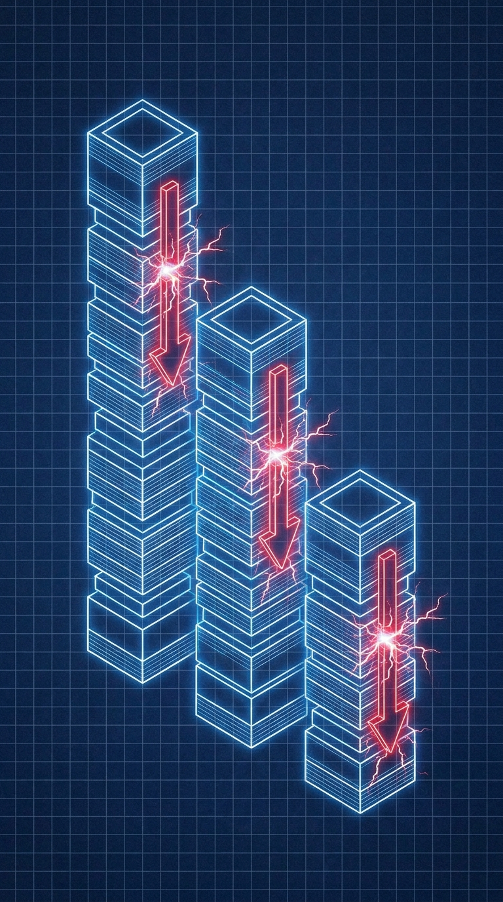

# Chapter 14: Liquidations

> **Part:** Part 3: Advanced Mechanics  
> **Estimated Reading Time:** 6 minutes  
> **Canonical Verification:** [docs.pacifica.fi](https://docs.pacifica.fi)  
> **Repository Index:** [The Pacifica Handbook](../README.md)

---

The three-tier liquidation process, the price formula, and the markets the backstop won't touch.



## TL;DR

* Liquidation fires when **account equity falls below maintenance margin** (½ of IMM).

* Pacifica uses a **three-tier process**: market liquidation → backstop → auto-deleveraging.

* The **backstop liquidator skips a list of experimental markets** (RWA equities, FX, commodities, pre-IPOs).

* **Spot insolvency** has a separate deleveraging path triggered at account level or pool level.

## 14.1. The trigger

Liquidation occurs when a user's **account equity falls below the maintenance margin** of open positions.

Maintenance margin on every market is **½ of the IMM** at the time the position was opened:

```
MM = 0.5 × IMM = 0.5 × (1 / max_leverage)
```

For a 10x BTC long, MM is 5% of notional. For a 50x BTC long, MM is 1%.

The liquidation price is computed from the position's side, size, equity, and mark price. From the docs:[1]

```
long:  liq_price = price − (equity − MM) / position_size
short: liq_price = price + (equity − MM) / position_size
```

Where:

* `equity` is `account_equity` for cross-margin positions (USDC + PnL + spot collateral − pending interest).

* `price` is the mark price if equity already reflects unrealized PnL.

For an isolated position, equity is the isolated margin balance plus unrealized PnL on that one position.

## 14.2. The three tiers

### Tier 1 — Market liquidation

When equity falls below MM but remains above the **backstop liquidation threshold (⅔ of MM)**:

* All open orders are **cancelled**, including ones that would otherwise reduce exposure.

* The position is liquidated by sending **market orders** into the orderbook.

* Orders are broken into **smaller chunks** (max of `0.75%` and `MM_ratio × 0.4` of position value) and placed as **IOC** orders as close to the backstop liquidation price as possible.

* A small fee — between 0.75% and 0.4 × MM — is retained by the liquidation engine.

* **Large positions** are sent with sub-second intervals between chunks. Average interval is **under 1 second**.

* If enough of the position is closed to restore MM, the **remainder stays with the trader** as a partial liquidation.

The market-liquidation path tries to keep the position on the book and let the trader keep any leftover equity.

### Tier 2 — Backstop liquidation

If equity falls below **⅔ of MM**, the position and remaining collateral are **transferred to a Pacifica backstop liquidator**. This is a special vault that systematically closes positions. The backstop exists to prevent orderbook disruption during large market moves.

The backstop **does not take positions** from the following markets — they are either experimental, illiquid externally, or both:[1]

```
URNM, GOLD, SILVER, PAXG, CL, COPPER, NATGAS, EURUSD, USDJPY,
NVDA, TSLA, PLTR, SP500, GOOGL, CRCL, HOOD, MEGA, BP
```

If your position is in one of these markets and you blow through Tier 1, you stay in market liquidation. If the book can't absorb the chunks, you may get auto-deleveraged.

### Tier 3 — Auto-deleveraging (ADL)

If equity falls below **zero** while a position is still open — meaning even the backstop couldn't close it without losses — Pacifica **closes opposing profitable traders' positions** based on risk priority.

ADL is the last resort. The system ranks profitable traders in the same market by their unrealized PnL and closes them in order until the loss is covered. The deleveraged trader keeps the PnL up to the close; they do not lose money they had already made.

ADL is **rare** on a healthy book. It's a backstop for the backstop.

## 14.3. Spot insolvency deleveraging — the separate path

Unified-margin accounts can hold **negative USDC balances** backed by spot collateral. A separate deleveraging path unwinds spot positions if:

* An individual account's spot collateral value is no longer sufficient to support the USDC debt plus any perp IMM.

* The money-market pool is at `utilization ≥ 95%` (pool-level deleveraging).

In both cases, the system **sells spot on the account's behalf** into the spot orderbook to repay USDC loans.

### Account-level

* Triggered per-borrower.

* Sells enough spot to bring the borrow back under LTV.

### Pool-level

* Triggered at `utilization ≥ 95%`.

* **Largest borrowers are deleveraged first**, regardless of their personal LTV.

* Target: bring utilization back to **90%**.

The "largest first" rule means a $5M borrower gets hit before a $5K borrower, even if the $5K borrower is more underwater. Pool-level deleveraging prioritizes the safety of the pool over individual fairness.

## 14.4. Worked example: a 10x BTC long liquidating

You open a **10x long BTC** at $70,000 with **$1,000 of cross-margin** ($10,000 notional, 0.1429 BTC).

| Field | Value |
| --- | --- |
| IMM | $1,000 |
| MM | $500 |
| Long liquidation price | $70,000 − ($1,000 − $500) / 0.1429 =$66,500 |

If BTC drops to $66,500:

* Equity = $500

* IMM (still) = $1,000

* MM = $500

* Equity = MM → **market liquidation** fires.

If BTC drops to $66,200:

* Equity ≈ $286

* ⅔ × MM = $333

* Equity < ⅔ MM → **backstop liquidator** takes over.

If BTC drops to $64,000 and the backstop can't close:

* Equity = negative

* **ADL** fires: the most profitable BTC-PERP longs on the other side of the book are closed against you.

## 14.5. Why isolated margin is safer

Isolated positions have a **dedicated margin budget**. The position can only be liquidated by the isolated margin going to zero, not by the rest of the account. If you want a hard cap on a single trade's loss, isolated is the right tool.

The trade-off: you can't draw on other equity to top up the position; if the isolated margin runs out, the position is closed regardless of the rest of your account.

## Pitfalls

* **Reading the rough 1/(2× leverage) liquidation distance as exact.** Funding, fees, and PnL all shift the level. Use the platform's liquidation price, not your calculator.

* **Holding positions in backstop-excluded markets.** Tier 1 still works; Tier 2 doesn't apply. If the book can't absorb the chunks, you go to ADL.

* **Confusing ADL with adversarial behavior.** ADL is mechanical; profitable counterparties on the other side are simply the least-bad source of liquidity.

* **Assuming a partial liquidation is bad.** A partial liquidation that returns the rest of the position to a healthy margin is a good outcome. The alternative is full liquidation.

## Sources

1. [Pacifica — Liquidations](https://docs.pacifica.fi/trading-on-pacifica/liquidations)

---

### Chapter Navigation
| Previous Chapter | Handbook Index | Next Chapter |
| :--- | :---: | ---: |
| [← Chapter 13: Money Market](13-money-market.md) | [**All 29 Chapters**](../README.md#table-of-contents) | [Chapter 15: Deposits & Withdrawals →](15-deposits-withdrawals.md) |

*Official Documentation verified against [docs.pacifica.fi](https://docs.pacifica.fi). Trade perpetuals with zero VC dilution at [app.pacifica.fi](https://app.pacifica.fi).*
