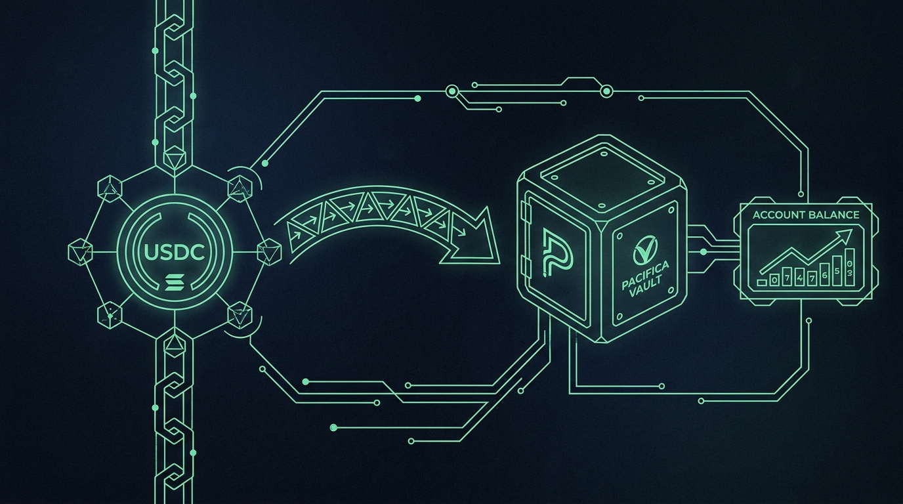
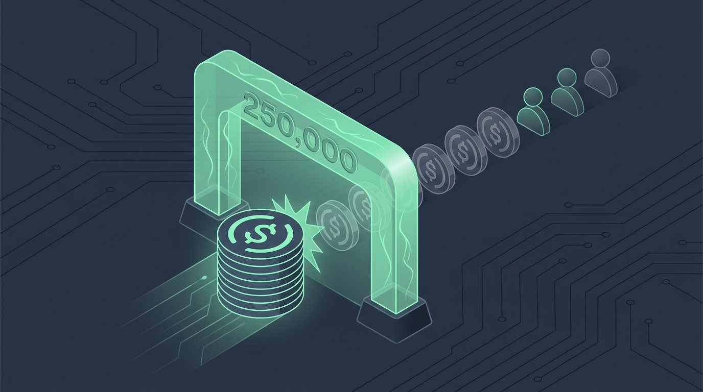

# Chapter 15: Deposits & Withdrawals

> **Part:** Part 3: Advanced Mechanics  
> **Estimated Reading Time:** 5 minutes  
> **Canonical Verification:** [docs.pacifica.fi](https://docs.pacifica.fi)  
> **Repository Index:** [The Pacifica Handbook](../README.md)

---

USDC and spot asset deposit/withdrawal mechanics, the closed-beta limits, and the on-chain bridge addresses.





## TL;DR

* USDC deposits go through the on-chain bridge at `72R843XwZxqWhsJceARQQTTbYtWy6Zw9et2YV4FpRHTa`.

* Closed-beta caps: **$250,000 account equity**, **$250,000 per 24 hours** per account for USDC withdrawal.

* Spot asset deposits have a **$50,000 per-asset per-day** cap; withdrawals have a **$250,000 per-asset per-day** cap.

* Subaccount transfers are **instant and fee-free** (USDC between subaccounts follows the existing API rules; spot transfers are free and instant).

## 15.1. USDC deposits

| Parameter | Value |
| --- | --- |
| Minimum deposit | $10 |
| Maximum account equity (closed beta) | $250,000 |
| Network fee | Gas only (Solana) |
| Required token | USDC on Solana |

The $250,000 cap is enforced on the frontend; deposits above the cap are gated in the UI, and API deposits above the cap are held in **pending** until the limit is raised.[1]

### How the deposit works

1. Click **Deposit → USDC** in the app.
2. Enter the amount (≥ $10, ≤ headroom to the equity cap).
3. Approve the SPL token transfer in your wallet.
4. The transfer is bridged to Pacifica's USDC bridge program at `72R843XwZxqWhsJceARQQTTbYtWy6Zw9et2YV4FpRHTa`.[2]
5. The matching engine credits your account after one Solana slot.

## 15.2. USDC withdrawals

| Parameter | Value |
| --- | --- |
| Minimum withdrawal | $1 |
| Per-account 24-hour cap (closed beta) | $250,000 |
| Network fee | $1 per withdrawal (gas) |

Withdrawals are bounded by `available_to_withdraw`, which deducts:

* Any outstanding money-market borrow.

* The 10% initial-margin floor.

* USDC locked by open spot buy orders.

An account with a **negative USDC balance** cannot withdraw USDC until either the debt is repaid or enough spot is sold to cover it.

There's an additional **exchange-wide withdrawal cap** that spans all assets; under normal market conditions it doesn't bite retail flow.[1]

### How the withdrawal works

1. Click **Withdraw → USDC** in the app.
2. Enter the amount (≥ $1, ≤ `available_to_withdraw`, ≤ remaining 24-hour cap).
3. The matching engine processes the withdrawal **instantly from the hot wallet**.
4. USDC is sent to your connected wallet.
5. The hot-wallet balance drops; if it falls below the programmed threshold, a replenishment is initiated from the cold vault (Chapter 3).

## 15.3. Spot asset deposits

| Parameter | Value |
| --- | --- |
| Minimum deposit | ~$10 worth of the asset |
| Per-asset per-day cap | $50,000 USD notional |
| Network fee | Gas only |

Spot assets are credited after on-chain confirmation. Once credited:

* The balance is tradeable on the corresponding spot market.

* It contributes to cross-margin collateral per the asset's LTV and per-user cap (Chapter 12).

### Per-user cap

The default `collateral_value_limit_usd` is **$10,000** per (user, asset). You can ask admin to raise it. Above the cap, the asset remains tradeable but contributes no additional collateral.

## 15.4. Spot asset withdrawals

| Parameter | Value |
| --- | --- |
| Per-asset per-day cap | $250,000 USD notional |
| Network fee | Network gas + ~$1 worth of the asset |

The maximum withdrawable amount for a given spot asset is bounded by:

```
max_withdraw = spot_balance
             - reserved_for_perp_margin
             - reserved_for_money_market_debt
             - locked_by_open_spot_sell_orders
```

The 10% initial-margin floor on `total_position_value` matches the constraint on USDC withdrawals.

If the request exceeds the per-day cap, it's queued for the next reset.

## 15.5. Subaccount transfers

**Spot assets** can be moved between a master account and any of its direct subaccounts **without an on-chain transaction**. Transfers are instant and fee-free. Asset movements are subject to standard margin requirements.[1]

**USDC** between subaccounts follows the existing Subaccount Fund Transfer API rules.

This is the cleanest way to allocate capital between strategies under one wallet.

## 15.6. Closed-beta limitations recap

| Limit | Value | When lifted |
| --- | --- | --- |
| USDC account equity | $250,000 | End of closed beta |
| USDC withdrawal | $250,000 / 24h | End of closed beta |
| Spot deposit per asset | $50,000 / day | Per-asset policy |
| Spot withdrawal per asset | $250,000 / day | Per-asset policy |
| Exchange-wide withdrawal | Soft, risk-driven | Risk-mitigation, not a fixed cap |

These are **policy** caps, not protocol caps. They can be lifted for individual users or globally.

## 15.7. On-chain bridge addresses

For verification, the four on-chain program addresses documented in the Fund Security page are:[2]

| Role | Address |
| --- | --- |
| USDC deposit/withdraw bridge | 72R843XwZxqWhsJceARQQTTbYtWy6Zw9et2YV4FpRHTa |
| SOL deposit/withdraw bridge | 9sSr35zwnFTuv2kZ86i55sR9dqQLTG663homexrLYgYu |
| USDC cold-vault | 5kwCMKjE3Krvs7cHfcQ9kBkGyPQphd3oJ4KnsXcpMoVc |
| SOL cold-vault | 8nFeyzTFhUXp11raJkSSvZWn9GXDjcrGq8LuzP9aKtg8 |

You can paste any into a Solana explorer to inspect the on-chain state.

## Pitfalls

* **Sending USDC on the wrong chain.** Pacifica only accepts **Solana USDC**. Bridged USDC from Ethereum / Base / Polygon must be bridged to Solana first.

* **Trying to withdraw a negative-balance USDC account.** Repay the borrow or sell spot first.

* **Hitting the per-day cap on a large transfer.** Withdrawals queue; come back the next day or split the withdrawal.

* **Forgetting that spot-withdraw constraints include the perp margin floor.** You cannot withdraw a spot asset to zero if your remaining spot collateral can't back your open perps.

## Sources

1. [Pacifica — Deposits & Withdrawals](https://docs.pacifica.fi/trading-on-pacifica/deposits-and-withdrawals)
2. [Pacifica — Fund Security (on-chain addresses)](https://docs.pacifica.fi/trading-on-pacifica/fund-security)

---

### Chapter Navigation
| Previous Chapter | Handbook Index | Next Chapter |
| :--- | :---: | ---: |
| [← Chapter 14: Liquidations](14-liquidations.md) | [**All 29 Chapters**](../README.md#table-of-contents) | [Chapter 16: Vaults — User-Deployed Trading Pools →](16-vaults.md) |

*Official Documentation verified against [docs.pacifica.fi](https://docs.pacifica.fi). Trade perpetuals with zero VC dilution at [app.pacifica.fi](https://app.pacifica.fi).*
