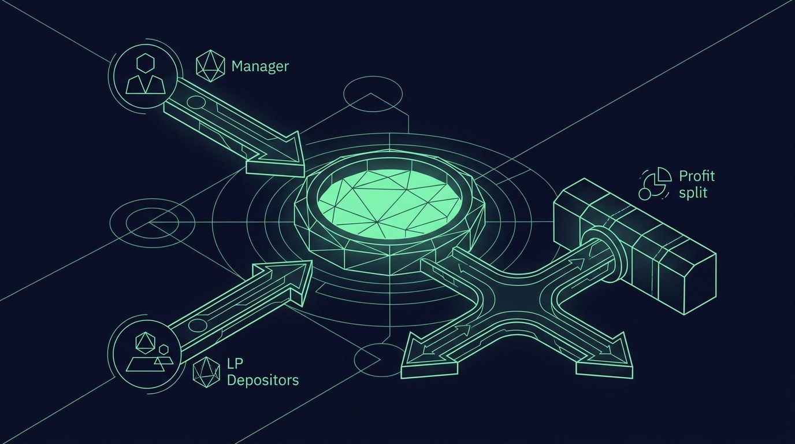
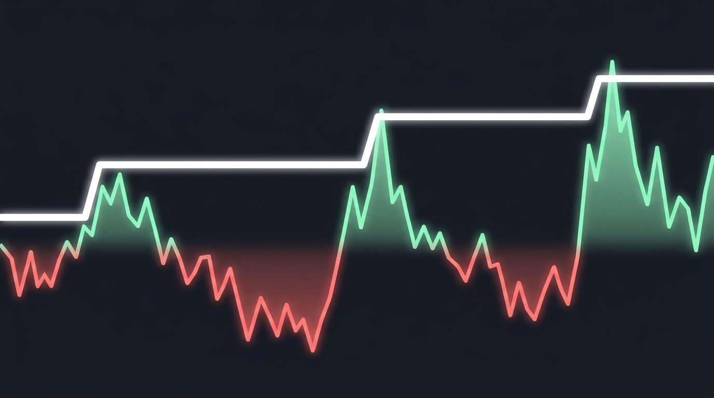

# Chapter 16: Vaults — User-Deployed Trading Pools

> **Part:** Part 4: Unique Products  
> **Estimated Reading Time:** 11 minutes  
> **Canonical Verification:** [docs.pacifica.fi](https://docs.pacifica.fi)  
> **Repository Index:** [The Pacifica Handbook](../README.md)

---

Deploy a managed trading pool, deposit into one, and understand PnL splits, the high-water mark, and risk controls.

## TL;DR

* A **vault** is a real Pacifica account managed by a designated address; **depositors** get LP shares, the **manager** gets Manager Shares.

* Both share classes own the same balance and the same positions; **PnL is split pro-rata** between them, then a **performance fee** is taken on profits above the **high-water mark**.

* The **creator** can configure **whitelist / blacklist / max leverage per symbol** to constrain the manager.

* If the manager's balance share falls below the **liquidation portion**, the engine **halts** trading and liquidates open positions.

## 16.1. What is a vault?

A vault is a **managed trading pool** deployed by a Pacifica user. Depositors contribute USDC; a designated **manager** trades the pooled balance on Pacifica; profits and losses are distributed to depositors according to the vault's configuration.

A vault is also a **real Pacifica trading account** — it is subject to the same margin, leverage, mark-price, and trading rules by default. The vault's balance is collectively owned by its depositors via **shares**, and the manager's actions are bounded by configurable trading constraints.[1]

> **The most important sentence in this chapter:** "Pacifica does not vet, audit, or insure third-party vault managers. Treat depositing into a vault the same way you would treat sending capital to any external trader."[2]

## 16.2. The three roles

| Role | Description |
| --- | --- |
| Creator | Address that callscreate_lakeand pays the creation fee. Sets the configuration; can update a small set of post-creation-mutable parameters. |
| Manager | Address authorized to place orders for the vault. Set at creation or claimed afterward viaclaim_lake_manager. Also deposits capital and holds Manager Shares. |
| LP / Depositor | Any address that deposits into the vault. Receives LP Shares proportional to the vault's NAV at deposit time. |

The creator and manager can be the same address, different addresses, or — for a fresh vault — the manager seat can be left open for a third party to claim later.

## 16.3. The two share classes

A vault tracks **two independent share classes** against the same pool of capital:

* **Manager Shares** — minted when the manager deposits, burned on withdrawal. They give the manager a claim on the manager-side balance and route their share of PnL through manager economics (including the performance fee on profits above the high-water mark).

* **LP Shares** — minted to any other depositor; follow the LP-side balance.

Both classes own the **same underlying account balance** and the **same set of positions**. PnL is split between the two classes pro-rata before any per-class economics apply.

## 16.4. The lifecycle

### Create

The creator pays the creation fee and chooses a configuration. The vault is assigned a fresh address and starts empty.

### Seed

The creator may seed the vault in the same call, or the manager (if different) may deposit later. A vault with `manager_min_balance_portion` set must satisfy that floor before LP capital is accepted by the deposit cap.

### Operate

The manager places orders for the vault subject to:

* The **symbol whitelist** (if set).

* The **symbol blacklist** (applied after whitelist).

* **Per-symbol max leverage** caps (if set).

* Standard exchange checks (margin, leverage, mark price).

LPs deposit and withdraw within the configured cooldowns and withdrawal windows.

### Halt or wind-down

If the manager's balance share falls below the configured **liquidation portion**, the engine halts trading and liquidates open positions. The manager can lift the halt by depositing back to the minimum balance portion. A vault with no remaining capital can be left dormant indefinitely.

## 16.5. How shares are priced on deposit

A deposit is converted into LP shares against the vault's **net asset value** at the moment of deposit. NAV is the lake account's equity (USDC + unrealized PnL on all positions, marked to mark price), with the period's PnL first attributed to existing shareholders.[2]

If the vault is empty for the LP class (`lp_shares == 0`), shares are minted **1:1** (1 share per 1 USDC).

The first step of a deposit is always a **"ledger sync"** that credits the period's profit or loss to the existing share classes. New shares are then minted at the post-sync NAV, so depositors **do not capture or share in PnL that accrued before their deposit**.

## 16.6. Deposit constraints

| Constraint | Source | Effect |
| --- | --- | --- |
| Minimum deposit | Constant10 USDC | Smaller amounts are rejected |
| Deposit cap | Vault configdeposit_cap | Total LP balance after the deposit cannot exceed the cap. Manager's own deposits are not counted |
| Available balance | Standard cross-margin check | Depositor must have sufficientavailable_to_withdraw |

## 16.7. Withdrawals

A withdrawal is denominated in **shares**. The amount returned is your proportional claim on the LP-side balance after the period's PnL has been credited.

A withdrawal is permitted only if all of the following hold:[2]

* The depositor holds at least the requested number of shares.

* If `deposit_min_duration_ms > 0` is configured, at least that many milliseconds have elapsed since the depositor's most recent deposit. Each new deposit **resets the timer for the entire share balance**, not just the new shares.

* If `withdraw_window_s` and `withdraw_duration_s` are configured, the current time falls within an open window. The window check is `current_unix_time_s mod withdraw_window_s < withdraw_duration_s`. **Windows are anchored to the Unix epoch (1970-01-01 00:00:00 UTC)**, not to the vault's creation time.

* The vault has sufficient `available_to_withdraw`. This is the lake account's free balance after subtracting margin reserved for open positions and orders. If the manager has the vault fully deployed, withdrawals may be partially unfilled until the manager closes or de-risks.

The redeemed amount is paid in USDC into the depositor's account immediately. The vault's **high-water mark is reduced** by the same dollar amount paid out, so future performance fees are charged on profit relative to the post-withdrawal balance rather than the pre-withdrawal peak.

### Withdrawal window example

With `withdraw_window_s = 86400` (1 day) and `withdraw_duration_s = 3600` (1 hour), withdrawals are open from **00:00 to 01:00 UTC every day**. Anchor at epoch, not at vault creation.

## 16.8. PnL attribution

### Profit period

If PnL over a period is positive, the manager first takes a **performance fee** on profits above the vault's high-water mark. The remainder is split pro-rata between LP and Manager balances by their share of the previous period's total balance.[3]

If `manager_profit_share` is unset, it defaults to zero and no performance fee is taken.

### High-water mark (HWM)

The performance fee is charged **only on equity above the previous all-time high**. If the vault has been at a loss since its last peak, no performance fee accrues until the prior peak has been recovered.[3]

The HWM moves monotonically upward through trading PnL. It also tracks deposits and withdrawals so they don't artificially trigger or skip the fee:

* On a **deposit**, the HWM increases by the deposit amount. New capital does not retroactively earn or pay fees on the prior peak.

* On a **withdrawal**, the HWM is reduced by the gross dollar amount paid out.

The HWM **never moves down through trading**. Drawdowns must be recovered before the manager earns another performance fee.

### Loss period

If PnL over a period is negative, the loss is split pro-rata between LP and Manager balances.

### Worked example: profit period

Vault with `manager_profit_share = 0.20`. Period start:

* Total equity: $1,000

* 500 Manager Shares (NAV = $1.00/share)

* 500 LP Shares (NAV = $1.00/share)

The vault trades to new equity of **$1,100**.

* Period PnL = $100

* New high → performance fee on profit above HWM = 20% × $100 = $20

* Remaining $80 split pro-rata by previous share of balance: 50/50 (each side had $500)

* LP gets $40 → 500 LP shares now worth $540 → NAV $1.08/share

* Manager side: $40 profit + $20 fee = $60 added → 500 Manager Shares now worth $560 → NAV $1.18/share

After the period, an LP deposits more USDC. The new shares are minted at the **post-sync NAV** ($1.08 for LP, $1.18 for Manager).

### Worked example: loss period

Same starting point. Vault trades to new equity of **$900**.

* Period PnL = −$100

* No performance fee (HWM unchanged)

* Loss split pro-rata: LP loses $50, Manager loses $50

* LP shares worth $450 → NAV $0.90/share

* Manager shares worth $450 → NAV $0.90/share

The HWM stays at $1,000. The manager will not earn a performance fee until equity recovers above $1,000.

## 16.9. Risk controls on the manager

Every order placed on a vault is checked against the vault's trading configuration in addition to standard exchange checks.[4]

| Constraint | Behavior |
| --- | --- |
| whitelist | If set, the order's symbol must be in the whitelist. If unset, all listed symbols are permitted. |
| blacklist | If set, the order's symbol must not be in the blacklist. Applied after the whitelist; a symbol in both lists is blocked. |
| max_leverages[symbol] | If set, the order's selected leverage on that symbol must not exceed this cap. If unset, the symbol's exchange-default max leverage applies. |
| trading_halt | If true, all order submissions on the vault are rejected. Set automatically by the liquidation worker; cleared by manager top-up. |

`whitelist`, `blacklist`, and `max_leverages` can be updated by the creator at any time. **Updates take effect on the next order. There is no notice period for depositors.**[4]

## 16.10. Manager balance portion

The manager's balance portion is the manager's share of the vault's total non-position USDC equity. Two thresholds in the vault config govern how this ratio is enforced:

| Threshold | Configured by | Used at |
| --- | --- | --- |
| manager_min_balance_portion | Creator (immutable) | Required to claim the manager seat on a fresh vault. Required to lift a trading halt after liquidation. |
| manager_liquidation_balance_portion | Creator (immutable) | When the live ratio falls below this threshold, the engine halts trading and liquidates open positions. |

`manager_liquidation_balance_portion` must be **strictly less than** `manager_min_balance_portion` if both are set. The gap between the two is a buffer: the manager has room to operate without being one bad tick away from a halt, but is required to top up past the higher threshold to resume trading.

If neither portion is configured, the engine does **not** auto-halt the vault on manager-balance grounds, and the LP is exposed to a manager who can in principle hold zero capital in the vault.

## 16.11. Risks

A depositor in a vault can lose up to their entire deposit. There is no Pacifica-funded backstop for vault losses beyond the standard exchange liquidation engine.[2]

Specific exposures:

* **Trading risk.** The manager's positions can lose money. Losses are taken from the LP balance pro-rata with the manager's balance. Cross-margin liquidations reduce the vault's USDC and may force a withdrawal queue if the lake account's `available_to_withdraw` drops to zero.

* **Manager risk.** The manager has discretion within the configured constraints. The creator may also widen those constraints over time (e.g., adding symbols to the whitelist). There is no notice period.

* **Liquidity risk.** Withdrawals require the vault to have free balance. Large drawdowns or fully-deployed positions can delay withdrawals until the manager closes positions or until liquidations run.

* **Window risk.** A vault with a withdrawal window restriction is not redeemable outside the window. Plan around the configured cycle.

* **Counterparty risk.** A vault deployed by a third party is not Pacifica-operated and is not insured by Pacifica.

## 16.12. As a manager — what you're committing to

Becoming a vault manager means:

* Putting your own capital at risk alongside LPs (if you don't seed, `manager_min_balance_portion` won't be met and you can't claim the seat).

* Operating within the creator's trading constraints, which can be widened without notice.

* Maintaining a manager balance portion above the liquidation threshold, or watching the engine halt and liquidate your positions.

* Taking a performance fee only on profits above the high-water mark, so a drawdown prevents future fees until recovery.

It's a real operating business, not a side feature.

## Pitfalls

* **Depositing into a vault without checking the manager's track record.** Vaults are zero-vetted by Pacifica.

* **Missing the deposit-min-duration cooldown.** Your withdrawal will be rejected if you deposited recently.

* **Forgetting the Unix-epoch anchor on withdrawal windows.** A vault created on Monday at 14:00 UTC still has windows at 00:00 UTC.

* **Assuming the creator's parameters are immutable.** Whitelist, blacklist, and max leverage can be widened without notice.

* **Reading "halt" as "dormant forever."** A halted vault can be revived by manager top-up to the minimum portion.

## Sources

1. [Pacifica — Vaults](https://docs.pacifica.fi/vaults)
2. [Pacifica — Depositing Into a Vault](https://docs.pacifica.fi/vaults/depositing)
3. [Pacifica — Profit & Loss](https://docs.pacifica.fi/vaults/profit-and-loss)
4. [Pacifica — Risk Controls](https://docs.pacifica.fi/vaults/risk-controls)

---

### Chapter Navigation
| Previous Chapter | Handbook Index | Next Chapter |
| :--- | :---: | ---: |
| [← Chapter 15: Deposits & Withdrawals](15-deposits-withdrawals.md) | [**All 29 Chapters**](../README.md#table-of-contents) | [Chapter 17: Print — Yield-Bearing Limit Orders →](17-print.md) |

*Official Documentation verified against [docs.pacifica.fi](https://docs.pacifica.fi). Trade perpetuals with zero VC dilution at [app.pacifica.fi](https://app.pacifica.fi?referral=SKYFOR).*
