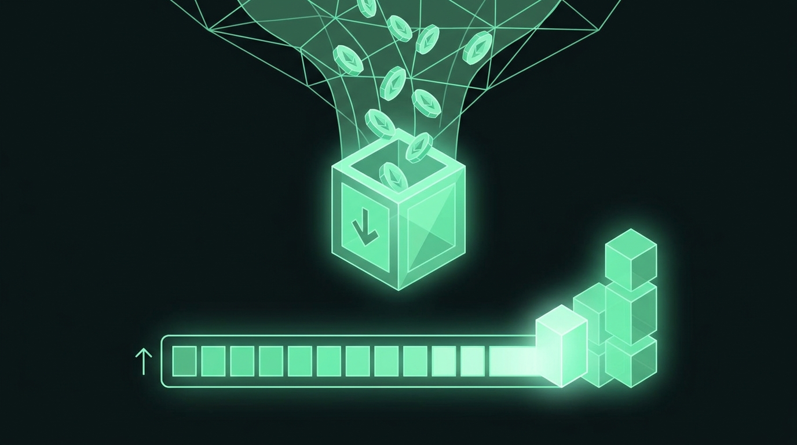

# Chapter 17: Print — Yield-Bearing Limit Orders

> **Part:** Part 4: Unique Products  
> **Estimated Reading Time:** 9 minutes  
> **Canonical Verification:** [docs.pacifica.fi](https://docs.pacifica.fi)  
> **Repository Index:** [The Pacifica Handbook](../README.md)

---

Set a target price, lock a deposit, and earn a payout every 24 hours while you wait. Plus the worked examples and the 20× ceiling.





## TL;DR

* A **Print order** is a limit order that pays you a **yield every 24 hours** while it waits to fill.

* It only checks at the **end of each 24-hour block**; intraday moves that reverse before the checkpoint don't fill you.

* Markets: **BTC and ETH** only. Leverage: **1× – 20×**. Target distance: **0.5% – 10%** from mark.

* The most you can lose is your **deposit + earned yield**. Nothing beyond.

## 17.1. The big idea

A normal limit order sits on the book until filled or cancelled. While it sits, it earns nothing.

A **Print order** is a limit order that **pays you a daily yield** while it waits. The order still opens your position at the exact target price you chose, but it does so only at the end of a 24-hour block — and until then, it earns.[1]

This is the right tool when you have a directional view but you're not in a hurry. You get paid to be patient.

## 17.2. How a Print order works

You set four inputs:[2]

* **Market** — BTC or ETH (the only two currently supported).

* **Direction** — Long (target below market) or Short (target above market).

* **Target price** — between **0.5% and 10%** from the current mark price.

* **Leverage** — **1× to 20×**.

* **Deposit** — your locked margin, minimum **$10**. Drawn from your Pacifica trading balance.

The order's notional is set by your deposit and leverage:

```
notional = deposit × leverage
position_size = notional / target_price
```

Once placed, the order enters a **24-hour cycle**.

## 17.3. The 24-hour cycle

Print orders run in fixed 24-hour blocks. At the end of every block, exactly one of two things happens:[3]

* **Fill** — if the mark price has reached or passed your target, the order fills at your target price and you now hold a normal leveraged position.

* **Roll over** — if it hasn't, the order automatically renews for another 24 hours at a **new target the same % distance from the new market price**, and keeps earning.

You earn the **full payout for the block** no matter which outcome occurs.

> "A limit order fills the instant the market touches it; a Print order is only evaluated at these 24-hour checkpoints. An intraday move to your target that reverses before the checkpoint does not fill your order."[3]

This is the most important difference. A trader used to instant limit fills will be surprised by the patience Print requires.

## 17.4. The yield

Your payout is paid at the start of each cycle by the Print liquidity pool and credited straight to your order, where it stays as part of your locked margin. It is shown as an annualized **APY**.[4]

Each cycle's payout is sized from your **original deposit** and current market conditions. Payouts do not compound on themselves. What the banked yield does do is add to your margin, which **nudges your liquidation price a little further from your target** each cycle.

### Three things push your yield up

* **Conviction (target distance).** The closer your target is to the current market price, the higher the yield — you're more likely to fill, so the pool pays you more to wait.

* **Leverage.** More leverage means a larger position, which means a larger payout.

* **Market volatility.** The more the market is moving, the larger the payout.

There is no trading fee on the yield. The protocol applies an internal floor and ceiling so the very tightest targets don't pay disproportionately.

Your APY isn't fixed. It's recalculated every cycle from current market conditions, and every roll-over re-prices at the new market.

## 17.5. The settled formulas

From the docs:[5]

```
max loss              = deposit + yield earned
position size         = deposit × leverage / target price

Long  liquidation price = target − (deposit + yield) × target / (leverage × deposit)
Short liquidation price = target + (deposit + yield) × target / (leverage × deposit)
```

The liquidation price sits roughly `target / leverage` away from your target, on the losing side. **Higher leverage moves the liquidation price closer to your target — more yield, but more risk.**

## 17.6. Specifications

| Parameter | Value |
| --- | --- |
| Markets | BTC, ETH |
| Cycle length | 24 hours |
| Leverage | 1× to 20× |
| Target distance from mark | 0.5% – 10% |
| Minimum deposit | $10 |
| Fill price | Your exact target price |
| Settlement | Once per 24-hour checkpoint |
| Yield crediting | At the start of each cycle; added to locked margin |
| Trading fee on yield | None |

Global position limits are set per market:

| Market | Global position limit | Equivalent deposit at 20× |
| --- | --- | --- |
| BTC | $5,000,000 | $250,000 |
| ETH | $2,000,000 | $100,000 |

When a market is at its cap, new Print orders there are rejected until existing ones resolve.[6]

## 17.7. The mechanics that differ from a normal position

Two important differences from a regular perp position:[5]

* **Liquidation is only checked at the 24-hour mark.** If the mark price is beyond your liquidation price at the end of a block, the order is liquidated and the margin is lost. Intraday moves that recover before the checkpoint do not liquidate you.

* **No maintenance margin while resting.** Before a Print order fills, there's nothing to top up — the deposit is the whole risk.

## 17.8. Worked example: a roll-over, then a fill

BTC is at $70,000. You place a **Print Long** with a **$100 deposit**, **10× leverage**, and a **target of $69,000** (about 1.43% below market).[7]

```
position size if filled = 100 × 10 / 69,000 ≈ 0.0145 BTC
notional = $1,000
```

**Day 1.** The order goes live. You're paid the block's yield. Over the next 24 hours, BTC dips to $69,200 intraday but never trades at or below $69,000 at the checkpoint. At the 24-hour mark, BTC is at $70,500 → **no fill**. The order rolls over to a new target the same ~1.43% below $70,500, which is approximately **$69,500**. The yield you earned stays in the account and the order runs into the next block.

**Day 2.** BTC drifts down. At the next 24-hour mark it's $69,300 — at or below your $69,500 target → **fill**. You open a ~0.0144 BTC long at exactly **$69,500**, funded by your deposit plus every payout you accrued. From here it's an ordinary 10× long.

The intraday dip on Day 1 didn't fill you, you kept all the yield, and you entered at your target price rather than a random intraday level.

## 17.9. Worked example: leverage table

Same Print Long (target $69,000, $100 deposit), before any yield:[7]

| Leverage | Position size | Notional | Liquidation price (rough) |
| --- | --- | --- | --- |
| 2× | 0.0029 BTC | $200 | ~$34,500 |
| 10× | 0.0145 BTC | $1,000 | ~$62,100 |
| 20× | 0.0290 BTC | $2,000 | ~$65,550 |

Higher leverage pays more yield, but the liquidation price climbs toward your $69,000 target — at 20×, the market only has to fall about 5% below your target to wipe the position. (Earned yield adds to your margin, so each cycle nudges the liquidation price a little further away.)

## 17.10. Cancelling

Cancelling a Print order sends an "end" request, but the order **stays active until the end of the current 24-hour block**. At that checkpoint it resolves one last time: it either fills (if the market reached your target) or returns your deposit to you. Either way, **you still earn that block's payout** — cancelling never forfeits yield already in progress.[2]

There is no in-place edit. To change your target or leverage, cancel the order and place a new one.

## 17.11. After a fill

When an order fills, closes, or is cancelled, your funds — the deposit plus earned yield, or the position it opened — return to your main Pacifica trading balance. Each Print order is its own margin bucket, separate from your other balances until it resolves.

A filled Print order becomes a **normal leveraged position** opened at your target price. From then on it follows normal perp rules: you can close it, add margin, or be liquidated like any other position.[8]

> **Note on the displayed leverage.** Your Print order's leverage (1× – 20×) is what sets the position's size and margin — those are locked in when you place the order. When the order fills, the position opens in your main perps account, and the leverage shown there is your account's leverage setting for that market (for example, 50× is the default on both BTC and ETH). That setting governs regular perp trading in your account; it doesn't enlarge the position your Print order opened. **Your size, entry price, and margin are exactly what your Print order specified** — nothing bypassed the 20× cap.[8]

## 17.12. Common questions

**Does my order fill the moment the price hits my target?** No. Only at the end of each 24-hour block.

**What price do I fill at if the market runs past my target?** Always your target price, not the market price at the checkpoint.

**Do I keep the yield if my order fills, or if I cancel?** Yes to both. The only way to lose accrued yield is liquidation.

**Can I lose more than my deposit?** No. The most you can lose is your deposit plus the yield it has earned — everything in the Print account, and nothing beyond it.

**Can I be liquidated while my order is still waiting to fill?** Liquidation is only evaluated at a 24-hour checkpoint. Intraday spikes that recover before the checkpoint don't liquidate you.

## Pitfalls

* **Expecting instant fills.** A Print order is patient by design. If you want instant, use a normal limit.

* **Confusing account leverage with Print leverage.** The 20× Print cap is on the Print order. The account-level leverage setting (e.g. 50× BTC) is a separate number on regular perps.

* **Hitting the global cap.** When BTC or ETH Print is at its cap, new orders are rejected. Wait for resolutions.

* **Setting the target too tight at 20× leverage.** A 0.5% target at 20× has the liquidation price very close to the entry — a small adverse move wipes the order.

## Sources

1. [Pacifica — Print](https://docs.pacifica.fi/print)
2. [Pacifica — Print: Placing & Managing Orders](https://docs.pacifica.fi/print/placing-and-managing-orders)
3. [Pacifica — Print: The 24-Hour Cycle](https://docs.pacifica.fi/print/the-24-hour-cycle)
4. [Pacifica — Print: Yield](https://docs.pacifica.fi/print/yield)
5. [Pacifica — Print: Margin & Liquidation](https://docs.pacifica.fi/print/margin-and-liquidation)
6. [Pacifica — Print: Specifications](https://docs.pacifica.fi/print/specifications)
7. [Pacifica — Print: Examples](https://docs.pacifica.fi/print/examples)
8. [Pacifica — Print: FAQ](https://docs.pacifica.fi/print/faq)

---

### Chapter Navigation
| Previous Chapter | Handbook Index | Next Chapter |
| :--- | :---: | ---: |
| [← Chapter 16: Vaults — User-Deployed Trading Pools](16-vaults.md) | [**All 29 Chapters**](../README.md#table-of-contents) | [Chapter 18: Swim — Tap Prediction Game →](18-swim.md) |

*Official Documentation verified against [docs.pacifica.fi](https://docs.pacifica.fi). Trade perpetuals with zero VC dilution at [app.pacifica.fi](https://app.pacifica.fi?referral=SKYFOR).*
