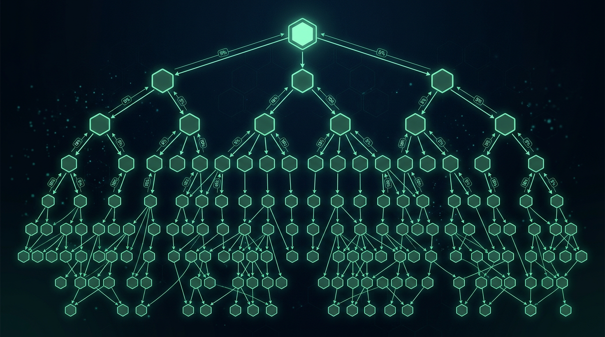

# Chapter 20: Referral & Affiliate Program

> **Part:** Part 5: Programs & Ecosystem  
> **Estimated Reading Time:** 5 minutes  
> **Canonical Verification:** [docs.pacifica.fi](https://docs.pacifica.fi)  
> **Repository Index:** [The Pacifica Handbook](../README.md)

---

Generate a referral link after $10,000 of volume, earn 10% of referee points, plus the affiliate tier up to 40% fee share.

## TL;DR

* Once you cross **$10,000 in volume**, you can generate a **referral link** at `app.pacifica.fi/referral`.

* **Referrers** receive **10%** of the points their referees generate. **Referees** get a **5% point bonus**.

* **Affiliates** receive **fee share incentives of up to 40%** from referees. Spots are selective.

* The portal updates every **15 minutes**.

## 20.1. The referral flow

1. Generate at least **$10,000** of trading volume on Pacifica.
2. Visit **[app.pacifica.fi/referral](https://app.pacifica.fi/referral)** and click **Generate Referral Link**.
3. Pick a referral name.
4. Share the link. Anyone who connects a **fresh** wallet through it becomes your referee.[1]

> **The portal updates once every 15 minutes.** If you've just hit $10,000 or just referred a friend, wait up to 15 minutes before the change shows.

## 20.2. The economics

| Side | Reward |
| --- | --- |
| Referrer(you) | 10%of the points generated by your referees |
| Referee(the friend) | 5% point bonuson their own points |

Rewards are automatically credited to your account alongside the weekly points distribution.

The 5% referee bonus is the user's incentive to sign up under a code. The 10% referrer share is your incentive to evangelize. Both are computed on the **points** the referee earns, not on fees.

## 20.3. How a referee attaches

There are two paths:

* **Referral link** — when joining Pacifica on a fresh wallet through a referral link, you're prompted to connect your wallet and claim the referral code. The referral uses one of the codes available to the referrer.

* **Referral code** — at the top-right of the app, the **Referral** section lets you enter a code manually. The account is linked as a referee to the user who generated the code.

In both cases, **the user must deposit** before the referral is recorded. An account that signs up via a link but never deposits doesn't trigger the reward.[1]

## 20.4. The affiliate program

Pacifica Affiliates receive **fee share incentives of up to 40%** from their referees. Spots are limited; participation is selective.

The fee share scales with the **total volume** the affiliate's referred users generate, so larger communities unlock higher percentages.

To apply: open a ticket at **[discord.gg/pacifica](https://discord.gg/pacifica)**.[1]

The affiliate program is targeted at influencers, content creators, and community leaders. If you bring 10,000+ active traders, this is the right program for you.

## 20.5. Exceptions to rewards

> "Referee accounts that become part of Pacifica's market maker program will no longer provide cash reward to their referrers."[1]

If a referee joins the Market Maker Program, their volume still earns you **points** but stops earning you **cash fee share**. The reasoning: market makers' fee structure is itself a program, and stacking referral cash on top would create a double incentive.

## 20.6. Strategy for referrers

* **Quality over quantity.** A referee who trades $100,000 in real volume is worth more than ten referees who each deposit $10 and never trade.

* **Help them succeed.** If your referee has a bad first trade and abandons the app, you earn nothing. Education, support, and shared screen-time help.

* **Pick a memorable code.** Your code is a brand. "BIGALPHA" beats "x7q9".

* **Use multiple channels.** Twitter, YouTube, Discord, Telegram — each channel can host a community that becomes a referee base.

## 20.7. The economics table

For a referee who generates **$1,000,000** in fees over their Pacifica lifetime and is on the standard fee schedule:

| Recipient | Reward |
| --- | --- |
| Referee (own points) | 100% of their earned points +5% bonusfor using your link |
| Referrer (you) | 10%of the referee's points |
| Affiliate (if applicable) | Up to 40%of the referee's fees |

The affiliate path is more lucrative in dollar terms when fee volume is high; the referrer path is more lucrative when points are valuable.

## Pitfalls

* **Generating a link before $10,000 of volume.** The button is gated; the engine will reject.

* **Forgetting that the referral only attaches on a fresh wallet.** A friend who already has history can't use your link.

* **Refereeing yourself.** Self-referrals are anti-gaming, not rewarded, and risk the program for both accounts.

* **Treating affiliate as an automatic upgrade.** Spots are selective; the bar is community size, not just volume.

* **Letting referees go dark.** A referee who never deposits never triggers rewards. The first week matters.

## Sources

1. [Pacifica — Referral and Affiliate Program](https://docs.pacifica.fi/programs/referral-and-affiliate-program)

---

### Chapter Navigation
| Previous Chapter | Handbook Index | Next Chapter |
| :--- | :---: | ---: |
| [← Chapter 19: Points Program](19-points-program.md) | [**All 29 Chapters**](../README.md#table-of-contents) | [Chapter 21: Market Maker Program →](21-market-maker.md) |

*Official Documentation verified against [docs.pacifica.fi](https://docs.pacifica.fi). Trade perpetuals with zero VC dilution at [app.pacifica.fi](https://app.pacifica.fi?referral=SKYFOR).*
