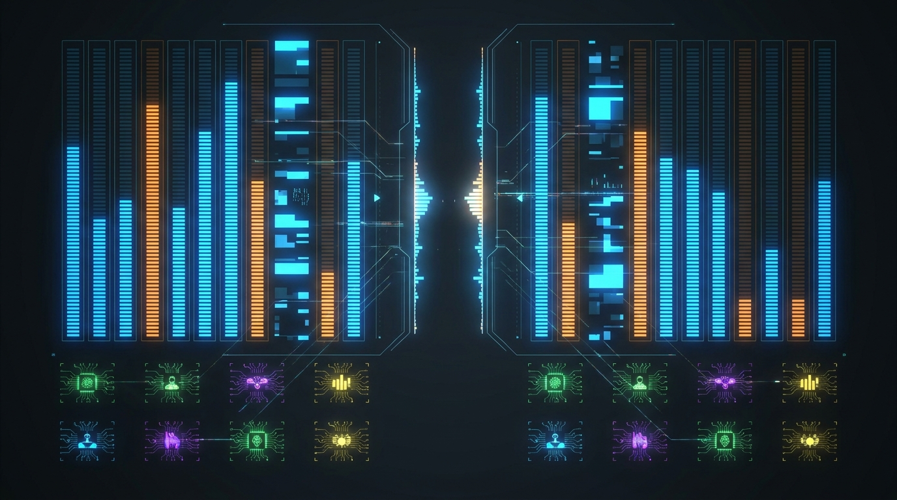

# Chapter 21: Market Maker Program

> **Part:** Part 5: Programs & Ecosystem  
> **Estimated Reading Time:** 5 minutes  
> **Canonical Verification:** [docs.pacifica.fi](https://docs.pacifica.fi)  
> **Repository Index:** [The Pacifica Handbook](../README.md)

---

Zero maker fees, increased rate limits, and a USD pool worth 12% of taker fees from MM counterparties.

## TL;DR

* The Market Maker (MM) program rewards **two-sided liquidity providers** with **zero maker fees**, increased rate limits, and increased deposit caps.

* The weekly USD pool is **12% of total trading fees collected from MM counterparties**.

* The weekly points pool is **2,000,000 points** (1,000,000/week).

* Rewards are paid every **14 days**, in points OR cash OR a combination of the two.

## 21.1. Why a market maker program exists

A healthy exchange needs tight spreads and deep books on both sides. The MM program exists to ensure both, by giving professional liquidity providers economic incentives to post consistent two-sided quotes.[1]

## 21.2. Benefits

| Benefit | Detail |
| --- | --- |
| Zero maker fees | The headline benefit. Every resting order that fills pays 0% in fees. |
| Increased rate limits | Crucial for HFT-style quoting. |
| Increased deposit caps | Beyond the standard closed-beta $250k ceiling, by arrangement. |

## 21.3. Eligibility

All Pacifica users are eligible to participate. **Opt-in is required** to set up reporting channels and apply for zero-maker-fee grace periods during ramp-up.[1]

To qualify for rewards beyond the initial program launch assessment period, an eligible MM must meet a **minimum requirement of X% of the Total MakerScore for the relevant period.** The exact number is determined later and can change over time.

> "The minimum requirement will be determined soon, and is subject to change over time based on liquidity conditions on Pacifica."

## 21.4. Scoring

Makers are scored on:

* **Maker volume**

* **Pairs traded**

* **Quote spread and depth**

* **Quote uptime**

The full scoring rubric is provided to applicants after they join the program. Email `ops@pacifica.fi` or open a Discord ticket to get the full spec.

## 21.5. Rewards

The rewards pool is split between a **USD pool** and a **points pool**:

| Pool | Source |
| --- | --- |
| USD pool | 12% of total trading fees collected from MM counterparties |
| Points pool | 2,000,000 points / 14 days = 1,000,000 points/week |

After a maker's score is calculated for each assessment period, the maker can choose to receive rewards as:

* **Points only**

* **Cash only**

* **A combination of the two**

The split is the maker's choice per period.

## 21.6. The fee mechanics

Makers pay **0%** on maker fills, but they pay the **regular taker fees** on any taker activity (lifting, market orders). The MM account is otherwise like a normal account, with one exception: **MM accounts and their subaccounts are ineligible for participation in exchange-wide trading competitions** unless explicitly specified.

MM accounts also earn points through the regular points program for non-maker activity.

## 21.7. Reporting

Makers receive **weekly reports** summarizing their maker performance (MakerScore, volume, spread, uptime). The report is the basis for the rewards distribution.

Rewards are sent during points distributions **every 14 days**.[1]

## 21.8. The opportunity cost

A maker chooses to take the program instead of paying standard fees. The economics:

* **Without the program:** pay 0.015% maker (Tier 1) and earn 0% on taker.

* **With the program:** pay 0% on maker, but maker rebates are not paid (you don't earn the 0.015% either). Earn from the rewards pool based on MakerScore.

The rewards pool is the upside. If your maker activity is consistent and your MakerScore is high, the program can be several times more lucrative than the standard fee schedule.

## 21.9. Operational fit

The program is best suited for teams that already run two-sided quoting:

* **HFT shops** with low-latency infrastructure.

* **Crypto-native market makers** with multi-venue systems.

* **Trading communities** with internal quoting bots.

* **Token project treasuries** that want to provide liquidity for their own token.

The on-ramp is the application. Reach out at `ops@pacifica.fi` or on Discord.

## Pitfalls

* **Joining without two-sided quoting.** One-sided liquidity isn't market making; it's a directional bet.

* **Quoting with wide spreads to maximize uptime.** The score weights spread and depth, not just uptime. A 5% spread for 24 hours is worse than a 0.05% spread for 8 hours.

* **Forgetting the 14-day payout cycle.** Cash and points are paid every two weeks, not daily.

* **Assuming zero maker fees is "free money."** You also don't earn the maker rebate; the economics come from the rewards pool.

## Sources

1. [Pacifica — Market Maker Program](https://docs.pacifica.fi/programs/market-maker-program)

---

### Chapter Navigation
| Previous Chapter | Handbook Index | Next Chapter |
| :--- | :---: | ---: |
| [← Chapter 20: Referral & Affiliate Program](20-referral-affiliate.md) | [**All 29 Chapters**](../README.md#table-of-contents) | [Chapter 22: Builder Program →](22-builder.md) |

*Official Documentation verified against [docs.pacifica.fi](https://docs.pacifica.fi). Trade perpetuals with zero VC dilution at [app.pacifica.fi](https://app.pacifica.fi).*
