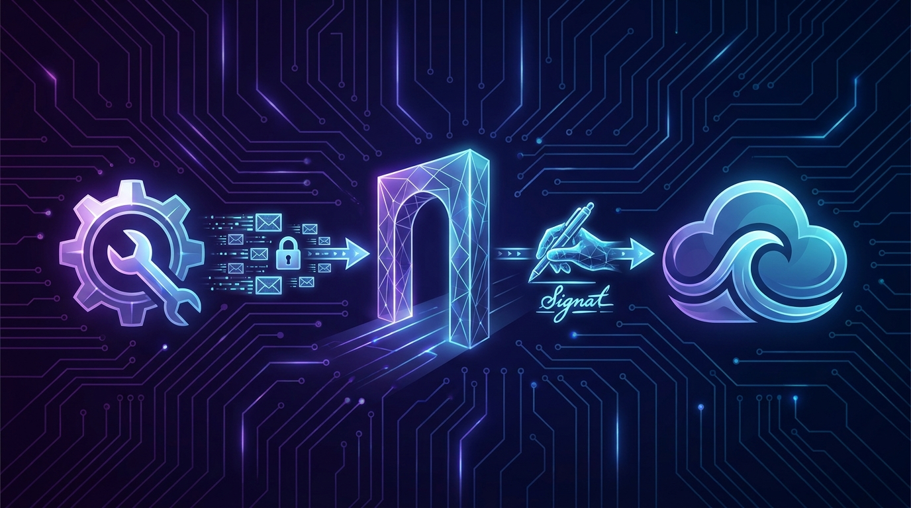

# Chapter 22: Builder Program

> **Part:** Part 5: Programs & Ecosystem  
> **Estimated Reading Time:** 6 minutes  
> **Canonical Verification:** [docs.pacifica.fi](https://docs.pacifica.fi)  
> **Repository Index:** [The Pacifica Handbook](../README.md)

---

Earn fees for orders you send on behalf of users, with up to 10,000,000 points reserved for teams building on Pacifica.

## TL;DR

* Builders earn **fees** for orders they send on behalf of users, with the user's **explicit approval** for a `builder_code` and `max_fee_rate`.

* Pacifica is setting aside **up to 10,000,000 points** for teams building on the Builder Program.

* All order-creation endpoints accept an optional `builder_code` — `create_market`, `create_limit`, `create_stop`, and `set_position_tpsl`.

* Users can revoke builder code authorization at any time.

## 22.1. What a builder is

A "builder" is a third-party developer who sends orders on behalf of a Pacifica user. This includes trading bots, AI agents, Telegram/Discord bots, copy-trading platforms, signal-based execution systems, and any other software that submits orders to Pacifica's matching engine.[1]

A builder:

1. **Registers a `builder_code`** with Pacifica.
2. **Asks users to approve the code** for use on their account, with a `max_fee_rate` ceiling.
3. **Includes the code** in every order they submit on the user's behalf.
4. **Earns a fee share** on every order that fills.

The user's wallet signs an approval message; the builder doesn't get custody or withdrawal rights.

## 22.2. The economics

| Side | Reward |
| --- | --- |
| User (referee) | Trades as usual; the only cost is the builder's fee, up to the user-approvedmax_fee_rate |
| Builder | Earns a fee on every order filled under theirbuilder_code |
| Pacifica | Earns a fee on the underlying order (the builder's fee is layered on top) |

The **builder code pool** — up to 10,000,000 points — is reserved to reward teams contributing meaningfully to Pacifica's growth.[1]

## 22.3. The approval flow

1. Builder registers a `builder_code` (alphanumeric, max 16 characters).[1]
2. Builder prompts the user to sign an approval request with the `builder_code` and the builder's `fee_rate` as `max_fee_rate`. The user signs.
3. Pacifica validates the signature and stores the approval.
4. The builder can now include the `builder_code` in any supported order-creation request.

The user signs with their Solana wallet (Ed25519). The signed payload is the standard `approve_builder_code` operation, with the compact and recursively sorted JSON format used by every Pacifica API call.

> **Validation rules**

> - The user's `max_fee_rate` must be **greater than or equal to** the builder's `fee_rate`. If lower, the orders are rejected.[1]

> - The `builder_code` must exist.

> - The user must have approved the `builder_code`.

A 403 error from the order endpoint means one of these is off.

## 22.4. Supported endpoints

All order-creation endpoints accept an optional `builder_code`:[1]

**REST:**

* `POST /api/v1/orders/create_market`

* `POST /api/v1/orders/create`

* `POST /api/v1/orders/stop/create`

* `POST /api/v1/positions/tpsl`

**WebSocket:**

* `create_market_order`

* `create_limit_order`

* `create_stop_order`

* `set_position_tpsl`

For TP/SL creation, the `builder_code` is provided at the top level — not within the individual `take_profit` or `stop_loss` objects.[1]

## 22.5. The signing contract

A few key implementation rules:

* All JSON keys must be **recursively sorted alphabetically** before compact JSON encoding.

* All times are in **milliseconds**.

* The expiry window defaults to **30 seconds (30,000 ms)** if not specified.

* `builder_code` is **optional** on every order endpoint.

The standard Pacifica signing scheme (Chapter 25) applies; the builder program doesn't introduce a new signing primitive.

## 22.6. Useful endpoints for builders

| Endpoint | Purpose |
| --- | --- |
| GET /api/v1/account/builder_codes/approvals?account=<WALLET> | List a user's approved builder codes |
| POST /api/v1/account/builder_codes/approve | Submit an approval signature |
| POST /api/v1/account/builder_codes/revoke | Revoke an approval |
| POST /api/v1/builder/update_fee_rate | Update the builder'sfee_rate |
| GET /api/v1/trades/history?account=<WALLET>&builder_code=<CODE> | Trade history for a specific builder code |
| GET /api/v1/builder/overview?account=<WALLET> | Builder code specs |
| GET /api/v1/builder/trades?builder_code=<CODE> | Builder trade history |
| GET /api/v1/leaderboard/builder_code?builder_code=<CODE> | Builder code user leaderboard |

## 22.7. Referral code claim

The same flow is used for **referral code claim** on the user side. A user signs a `claim_referral_code` payload that ties their account to a referral code's owner. Once claimed, the user is a referee of that code's owner (see Chapter 20).[1]

## 22.8. Error handling

| Code | Cause |
| --- | --- |
| 403 Unauthorized | User hasn't approved the builder code, ormax_fee_rateis too low |
| 404 Not Found | Builder code doesn't exist |
| 400 Bad Request | Invalid builder code format (must be alphanumeric, max 16 characters) |

## 22.9. What good builders build

The 10M-point pool is **not** a free-for-all. The team evaluates contributions to Pacifica's growth. Categories that tend to qualify:

* **AI agents** that take natural-language trading instructions and execute on Pacifica.

* **Copy-trading platforms** that follow successful traders and replicate on user accounts.

* **Signal-based systems** that consume off-chain data (news, social) and execute on Pacifica.

* **Telegram/Discord bots** that bring retail flow.

* **Portfolio rebalancers** that manage user exposure across perps and spot.

* **Educational tools** that show users what their bot would do before they sign.

The unifying factor: each of these **brings real volume** to Pacifica.

## Pitfalls

* **Asking for a `max_fee_rate` higher than the user expects.** A 5% max fee on a high-volume bot is a real cost. Be transparent.

* **Forgetting the recursive JSON sort.** Signature verification fails if the payload isn't compact-sorted.

* **Skipping the testnet.** The Builder Program is complex; rehearse approval and revocation on testnet before touching real money.

* **Assuming the order is free because the user approved.** The user still pays the standard taker/maker fees; the builder fee is on top.

## Sources

1. [Pacifica — Builder Program](https://docs.pacifica.fi/programs/builder-program)

---

### Chapter Navigation
| Previous Chapter | Handbook Index | Next Chapter |
| :--- | :---: | ---: |
| [← Chapter 21: Market Maker Program](21-market-maker.md) | [**All 29 Chapters**](../README.md#table-of-contents) | [Chapter 23: VIP, Educators & Bug Bounty →](23-vip-educators-bug-bounty.md) |

*Official Documentation verified against [docs.pacifica.fi](https://docs.pacifica.fi). Trade perpetuals with zero VC dilution at [app.pacifica.fi](https://app.pacifica.fi).*
