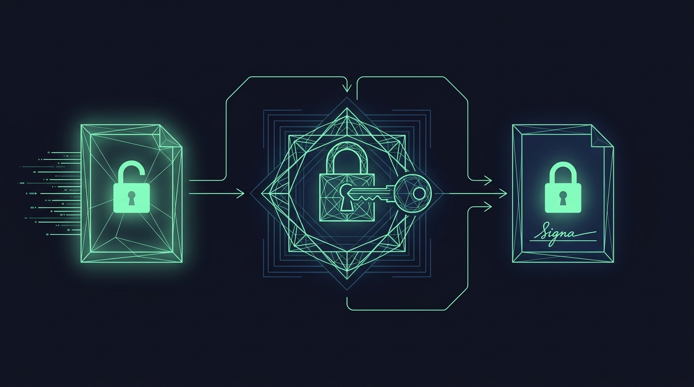

# Chapter 25: Signing & Authentication

> **Part:** Part 6: For Developers  
> **Estimated Reading Time:** 5 minutes  
> **Canonical Verification:** [docs.pacifica.fi](https://docs.pacifica.fi)  
> **Repository Index:** [The Pacifica Handbook](../README.md)

---

Ed25519 signatures, the compact sorted JSON payload format, and the operation-type registry.

## TL;DR

* Every mutating Pacifica API request carries an **Ed25519 signature** in the headers.

* The signed payload is a **deterministic, compact, recursively sorted JSON** of the request body.

* The signing header includes a **type**, **timestamp**, **expiry window**, and the **public key**.

* A **hardware wallet** path exists for high-security use cases.

## 25.1. Why deterministic JSON

Blockchains and CEXs both need a way to sign a structured request. The naive approach — sign the bytes of the JSON you have — fails because JSON has multiple valid serializations for the same data: `{"a":1,"b":2}` and `{"b":2,"a":1}` are semantically identical but byte-different.

Pacifica's fix: **canonicalize the payload to a single form**, then sign the bytes. The rules:[1]

* Keys are sorted **alphabetically**.

* The sort is **recursive** — every object, at every depth.

* Whitespace is removed (compact JSON).

* All times are in **milliseconds**.

* Numbers are integers where possible.

This means **the same logical request always serializes to the same bytes**, so the signature is reproducible and verifiable.

## 25.2. The signing header

A signed request carries additional headers:

| Header | Meaning |
| --- | --- |
| Account | The Solana public key (base58) of the signing account |
| Signature | Base58 Ed25519 signature of the compact sorted payload |
| Timestamp | The current time in milliseconds |
| Type | The operation type, registered in the operation-types table |
| Expiry Window | Default30,000 ms(30 seconds) — the request must arrive within this window ofTimestamp |

The server verifies:

1. The `Account` matches the body's account field.
2. The signature is valid for the compact sorted JSON.
3. The current server time is within `Expiry Window` of `Timestamp`.
4. The `Type` matches the request's endpoint.

A mismatch on any of these returns a 4xx error.

## 25.3. The operation-type registry

The `Type` field is a registered string that tells the server **which endpoint is being called** and what the body shape is. The full registry is documented in `signing/operation-types.md`.[2]

Examples (from the documentation):

| Endpoint | Type |
| --- | --- |
| POST /orders/create_market | create_market_order |
| POST /orders/create | create_limit_order |
| POST /orders/stop/create | create_stop_order |
| POST /positions/tpsl | set_position_tpsl |
| POST /account/leverage | update_leverage |
| POST /account/margin_mode | update_margin_mode |
| POST /withdraw | request_withdrawal |
| POST /subaccounts/fund_transfer | subaccount_fund_transfer |
| POST /builder_codes/approve | approve_builder_code |
| POST /builder_codes/revoke | revoke_builder_code |

The registry is the contract. If you use the wrong `Type`, the request is rejected.

## 25.4. The reference implementation

Pacifica publishes a **step-by-step guide** in `signing/implementation.md`.[1] The reference flow:

1. Build the request body as a JSON object.
2. Recursively sort all keys alphabetically.
3. Serialize to compact JSON (no whitespace).
4. Sign the resulting bytes with Ed25519 using the user's private key.
5. Base58-encode the signature.
6. Submit the request with the signing headers.

In TypeScript / JavaScript, the canonical sort uses a recursive `Object.keys().sort()` walk. In Python, the equivalent is `json.dumps(obj, sort_keys=True, separators=(',', ':'))`. Both produce byte-identical output for the same logical payload.

## 25.5. Common errors

A request can be rejected at signature time for several reasons:[3]

* **Wrong `Type`** — the type doesn't match the endpoint.

* **Stale timestamp** — the server time is outside the expiry window.

* **Bad compact sort** — keys aren't recursively sorted; the signature doesn't match the expected bytes.

* **Wrong account** — the `Account` header doesn't match the body's account field.

* **Replay** — a previously seen signature, in the rare case the server has cached it.

Each error returns a 400 with a specific code; the docs list the codes and their meanings.

## 25.6. Hardware wallet support

A **hardware wallet path** is supported for users who want to keep their keys offline. The hardware wallet signs the same payload, but the signature is delivered through a browser-bridge (Ledger via Phantom, for example).[4]

The trade-off: hardware signing adds a few hundred milliseconds per request and requires physical confirmation on the device. It's not appropriate for high-frequency strategies; it's perfect for treasury operations, large withdrawals, and any request where a few seconds of latency is acceptable.

## 25.7. API Agent Keys

For automated strategies, you don't want a hot private key on every bot instance. Pacifica supports **API Agent Keys** — scoped keys that can sign on behalf of an account, with a configurable permission set.[5]

The agent key model is similar to "API keys" on a CEX, but with the Ed25519 primitive:

* The agent key is itself an Ed25519 keypair.

* It's registered against a master account via a signed registration request.

* Subsequent agent-key-signed requests are accepted by the server, with the master account as the actor.

The operational flow is: keep the master key in cold storage, run agents with agent keys, and rotate agent keys as needed.

## 25.8. The "no signature, no order" rule

Every endpoint that mutates account state requires a signed request. This includes:

* All order operations.

* All account settings (leverage, margin mode, spot settings).

* All withdrawals.

* All vault operations.

* All subaccount operations.

A read-only endpoint (`GET /info`, `GET /orderbook`, `GET /positions`) does not require a signature. A streaming WebSocket subscription does not require a signature per message; authentication is done at connection time.

## Pitfalls

* **Skipping the recursive sort.** A non-recursive sort produces a valid JSON but invalid signature. Use a tested library.

* **Forgetting the expiry window.** A request with a stale timestamp is rejected silently; the client sees a 400 with no clear cause.

* **Using the wrong `Type`.** A `create_market_order` type on a limit order endpoint is rejected. Always cross-check.

* **Replaying a signature in a different network.** Signatures are bound to the chain and the account; don't try to cross-use them.

* **Treating API Agent Keys as low-trust.** They're scoped keys; an agent-key compromise is still a master-account compromise unless the scope is limited.

## Sources

1. [Pacifica — Signing Implementation](https://docs.pacifica.fi/api-documentation/api/signing/implementation)
2. [Pacifica — Operation Types](https://docs.pacifica.fi/api-documentation/api/signing/operation-types)
3. [Pacifica — Error Handling](https://docs.pacifica.fi/api-documentation/api/signing/error-handling)
4. [Pacifica — Hardware Wallet](https://docs.pacifica.fi/api-documentation/api/signing/hardware-wallet)
5. [Pacifica — API Agent Keys](https://docs.pacifica.fi/api-documentation/api/signing/api-agent-keys)

---

### Chapter Navigation
| Previous Chapter | Handbook Index | Next Chapter |
| :--- | :---: | ---: |
| [← Chapter 24: API Overview](24-api-overview.md) | [**All 29 Chapters**](../README.md#table-of-contents) | [Chapter 26: MCP Server for AI Agents →](26-mcp-server.md) |

*Official Documentation verified against [docs.pacifica.fi](https://docs.pacifica.fi). Trade perpetuals with zero VC dilution at [app.pacifica.fi](https://app.pacifica.fi?referral=SKYFOR).*
