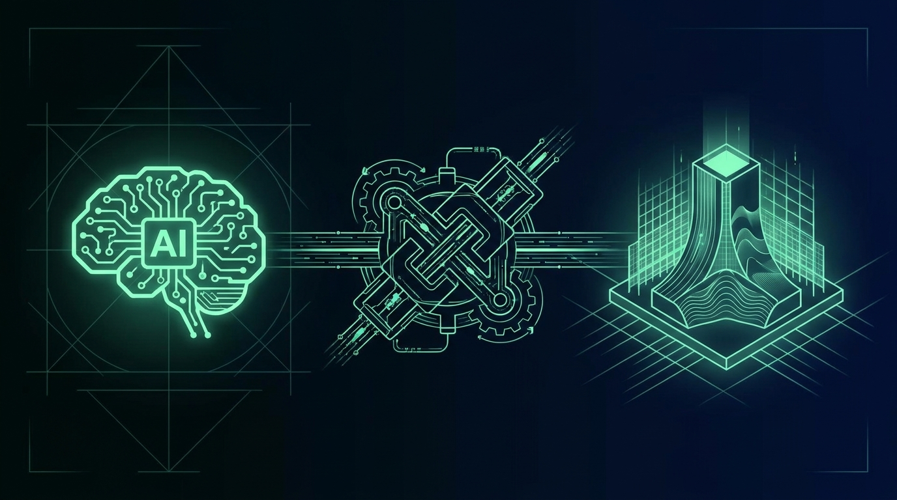

# Chapter 26: MCP Server for AI Agents

> **Part:** Part 6: For Developers  
> **Estimated Reading Time:** 5 minutes  
> **Canonical Verification:** [docs.pacifica.fi](https://docs.pacifica.fi)  
> **Repository Index:** [The Pacifica Handbook](../README.md)

---

Expose Pacifica's REST API as Model Context Protocol tools so any MCP-compatible client — Claude, OpenAI Codex, Hermes, Crush — can trade.



## TL;DR

* The **Pacifica MCP server** exposes the REST API as **Model Context Protocol** tools.

* Configured in **Claude Desktop, Claude Code, OpenAI Codex, Factory, Hermes, and Crush**.

* Two authentication modes: **agent key** (programmatic) and **wallet signature** (interactive).

* The tool surface covers **markets, account, orders, vaults, subaccounts, and spot**.

## 26.1. What is MCP?

**Model Context Protocol (MCP)** is a standard for connecting LLMs to external tools. An MCP server exposes a set of typed tools with JSON-schema inputs; an MCP client (a chat assistant, an IDE, an agent framework) discovers the tools, decides when to call them, and feeds the results back to the model.

Pacifica ships an MCP server that wraps the REST API. The tools are the same operations as the REST endpoints, but addressable by name from a language model. A user can ask Claude to "open a $500 long on BTC at 10x" and the model calls the right tool with the right parameters.

## 26.2. Why this matters

Two reasons:

1. **Agents can trade.** A natural-language instruction becomes a signed order.
2. **Agents can read.** The same model can pull positions, equity, and PnL into a reasoning loop.

The agent becomes a **first-class user** of Pacifica, with the same access as a human at the GUI.

## 26.3. Authentication modes

The MCP server supports two modes:[1]

### Agent key mode (programmatic)

For bots and autonomous agents:

* An **API Agent Key** is registered against a master account (Chapter 25).

* The MCP server holds the agent key in its environment.

* Requests are signed automatically; the agent calls the tool with parameters.

* The master key never leaves cold storage.

This is the right mode for production agents that need unattended operation.

### Wallet signature mode (interactive)

For human-in-the-loop flows:

* The MCP server is paired with a connected wallet (Phantom, Solflare, etc.).

* Each mutating tool call requires a fresh signature from the user.

* The signature is collected through the MCP client and forwarded to Pacifica.

This is the right mode for AI assistants that suggest actions and let the human confirm.

## 26.4. Configuration

The MCP server is configured via environment variables:[2]

| Variable | Purpose |
| --- | --- |
| PACIFICA_API_URL | REST API base URL |
| PACIFICA_WS_URL | WebSocket base URL |
| PACIFICA_AGENT_KEY | Base58 agent private key (agent mode) |
| PACIFICA_ACCOUNT | Public key of the account |
| PACIFICA_NETWORK | mainnetortestnet |

A typical config for an agent:

```
PACIFICA_API_URL="https://api.pacifica.fi"
PACIFICA_WS_URL="wss://api.pacifica.fi/ws"
PACIFICA_AGENT_KEY="<base58 private key>"
PACIFICA_ACCOUNT="<base58 public key>"
PACIFICA_NETWORK="mainnet"
```

For testnet:

```
PACIFICA_API_URL="https://test-api.pacifica.fi"
PACIFICA_WS_URL="wss://test-api.pacifica.fi/ws"
PACIFICA_NETWORK="testnet"
```

## 26.5. Client setup

The MCP server integrates with a handful of popular clients out of the box:[3]

* **Claude Desktop** — add the server in `claude_desktop_config.json`.

* **Claude Code** — CLI-level config; same shape.

* **OpenAI Codex** — via the Codex config file.

* **Factory** — a popular agent framework.

* **Hermes** — open-source agent.

* **Crush** — terminal-first agent.

The configuration is essentially the same: point the client at the MCP server, provide the env vars (or a path to a `.env` file), and the tool list appears in the model context.

### Example: Claude Desktop

```
{
  "mcpServers": {
    "pacifica": {
      "command": "pacifica-mcp",
      "env": {
        "PACIFICA_API_URL": "https://api.pacifica.fi",
        "PACIFICA_NETWORK": "mainnet",
        "PACIFICA_AGENT_KEY": "...",
        "PACIFICA_ACCOUNT": "..."
      }
    }
  }
}
```

Once configured, the model can call any Pacifica tool by name. The tool list is large but well-grouped.

## 26.6. The tool surface

The full tool list is documented in `mcp/tools.md`.[4] It mirrors the REST surface, grouped by category:

| Group | Example tools |
| --- | --- |
| Markets | get_market_info,get_prices,get_orderbook,get_recent_trades,get_funding_history,get_candle_data |
| Account | get_account_info,update_leverage,update_margin_mode,get_positions,get_trade_history,get_funding_history,get_equity_history |
| Orders | create_market_order,create_limit_order,create_stop_order,set_position_tpsl,cancel_order,cancel_all_orders,edit_order,batch_order |
| Vaults | create_vault,deposit_to_vault,withdraw_from_vault,update_vault_deposit_cap,add_vault_whitelist,add_vault_max_leverage,list_vaults |
| Subaccounts | create_subaccount,list_subaccounts,subaccount_fund_transfer,subaccount_spot_transfer |
| Spot | get_spot_assets,get_bridge_info,withdraw_spot_asset,get_spot_balance_history |

A few additional tools cover rate-limit introspection, fee tier lookups, and account loan info.

## 26.7. A worked agent loop

Suppose an LLM agent is tasked with: *"Reduce my BTC long by 50% if the price drops 3% from my entry."*

The agent loop:

1. Call `get_positions` to find the BTC long's entry and size.
2. Compute the threshold: `entry × 0.97`.
3. Subscribe to `prices` for BTC and observe.
4. When the price crosses the threshold, call `create_market_order` with `side=sell`, `size = current_size × 0.5`.
5. Confirm with `get_positions` and report back.

Each step is a typed tool call; the model reasons about the sequence. The MCP server handles the signing, the API call, and the response.

## 26.8. The reference repo

Pacifica publishes the MCP server as an open-source repository at **`github.com/pacifica-fi/pacifica-mcp`**.[5] The repo includes:

* The MCP server source.

* Configuration examples for each supported client.

* A test suite for the tool bindings.

You can fork it, audit it, and run your own.

## 26.9. Operational safety

A few practical safety rules for agents:

* **Always confirm wallet-signed mode in production.** Unattended signing in a chat context is a recipe for accidental orders.

* **Scope agent keys tightly.** A scoped agent key (read-only, or restricted to specific markets) is much safer than a master-scoped key.

* **Log every tool call.** The MCP client should surface every invocation; users should review the log.

* **Set position-size limits at the prompt level.** Don't expect the model to never oversize. Add a guardrail.

* **Test on testnet first.** The MCP server is identical for mainnet and testnet; switch `PACIFICA_NETWORK` and rehearse.

## Pitfalls

* **Trusting the model to size correctly.** LLMs can and do produce unreasonable numbers. Cap position sizes at the prompt or in a wrapper.

* **Skipping the human-in-the-loop.** For wallet-signed mode, require explicit confirmation for every mutating tool call.

* **Using a master-scoped key for an agent.** If the agent is compromised, the master account is too. Use a scoped agent key.

* **Forgetting to rotate agent keys.** A long-lived agent key in production is a long-lived vulnerability.

## Sources

1. [Pacifica — MCP Server](https://docs.pacifica.fi/api-documentation/api/mcp)
2. [Pacifica — MCP Configuration](https://docs.pacifica.fi/api-documentation/api/mcp/configuration)
3. [Pacifica — MCP Client Setup](https://docs.pacifica.fi/api-documentation/api/mcp/clients)
4. [Pacifica — MCP Tools](https://docs.pacifica.fi/api-documentation/api/mcp/tools)
5. [Pacifica — MCP Reference Repo (GitHub)](https://github.com/pacifica-fi/pacifica-mcp)

---

### Chapter Navigation
| Previous Chapter | Handbook Index | Next Chapter |
| :--- | :---: | ---: |
| [← Chapter 25: Signing & Authentication](25-signing-auth.md) | [**All 29 Chapters**](../README.md#table-of-contents) | [Chapter 27: Glossary of Terms →](27-glossary.md) |

*Official Documentation verified against [docs.pacifica.fi](https://docs.pacifica.fi). Trade perpetuals with zero VC dilution at [app.pacifica.fi](https://app.pacifica.fi?referral=SKYFOR).*
